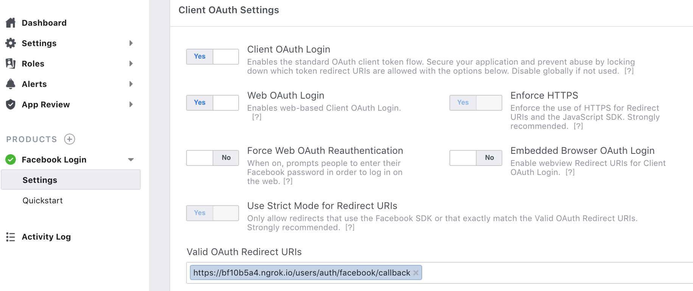
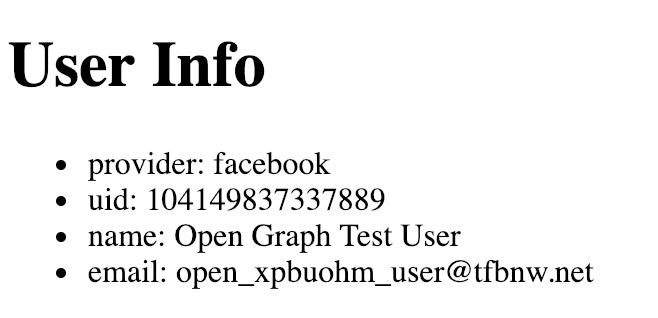

# Adding OAuth - Server Side Flow

This document explains steps to authenticate users by OAuth using Facebook as OAuth provider.
When all steps in this document are completed, the entire repository will look like this
__[textblog repo](https://github.com/yokolet/textblog/tree/c414a43a4c526712c0bfaccd4d6ba32cb21fef3a)__.

Before trying steps of this document, OAuth provider setting should be completed and tested.
Read [Setting Up Facebook Login](./SettingUpFacebookLogin.md) to learn how to setup
OAuth by Facebook.

This document focuses only on Rails side. This type of authentication sequence is called a
server side flow. In this flow, the server will have `access_token` first.
In another document, OAuth with React and GraphQL will be discussed.
Another one is called a client side flow. In case of the client side flow,
ReactJS (client) will initiate the OAuth flow and have `access_token` first.

In the end, this app will use the client side OAuth flow.
So, Rails side OAuth implementation is for, just in case,
the server side flow is needed to authenticate a user.
The server side flow here is mostly for testing purpose for this textblog app.

1. Install OAuth related gems

    Typical gems for Rails to provide OAuth feature is `omniauth`, which works with `devise`.
    Not to expose Facebook APP ID and Secret, `dotenv-rails` gem is used here,
    but `dotenv` is only for development and test. When the app is deployed on cloud,
    such as Heroku, a cloud specific way of setting environment variables exists.
    
    - Add `devise` and `omniauth-facebook` gems
        ```ruby
        # OAuth
        gem 'devise', '~> 4.5'
        gem 'omniauth-facebook', '~> 5.0'
        ```
    - Add `dotenv-rails` in develoment/test section
        ```ruby
        group :development, :test do
          # Call 'byebug' anywhere in the code to stop execution and get a debugger console
          gem 'byebug', platforms: [:mri, :mingw, :x64_mingw]
          ....
          ....
          gem 'dotenv-rails', '~> 2.5'
        end
        ```
    - Run `bundle install`

2. Setup `devise`

    Do below to setup `devise`. These are common steps to start using `devise`.
    The command below assumes User model is already there. In this app, the User model
    was created while going over [Getting Started](./GettingStarted.md).

    - `rails g devise:install`
    - `rails g devise User`
    
    Some of devise setting blog posts include `rails g devise:views` in addition to two above.
    However, this app doesn't need devise view. Since this app's client side is
    ReactJS, it doesn't use a traditional HTML page.
    
    Before running migration, `email` line should be commented out from the migration file
    since `email` column has been created already.
    
    - Open `db/migrate/TIMESTAMP_add_devise_to_users.rb`
    - Comment out the line `# t.string :email, null: false, default: ""` 
    - `rails db:migrate`

3. Set Facebook App ID and Secret

    Create `.env` file in the Rails' top directory.
    ```bash
    FB_APP_ID=YOURFACEBOOKAPPID
    FB_APP_SECRET=YOURFACEBOOKAPPSECRET
    ```
    Read [Setting Up Facebook Login](./SettingUpFacebookLogin.md) what to write
    in two env variables.
    
    Don't forget to add `.env` in `.gitignore`.

4. Add configuration to use Facebook as OAuth provider

    Add below in `config/initializers/devise.rb`.
    ```ruby
    config.omniauth :facebook, ENV['FB_APP_ID'], ENV['FB_APP_SECRET']
    ```

5. Add more fields to User model

    After OAuth authentication, Facebook gives token, uid and some more information
    about the user. To save those in the User model, adds fields.

    - Create a migration
    ```bash
    rails g migration AddOmniauthToUsers provider:string uid:string
    ```
    - `rails db:migrate`

6. Make the user model omniauthable

    Add `devise :omniauthable, omniauth_providers: [:facebook]` to `app/models/user.rb`.
    Delete the rest of `devise` settings.
    ```ruby
    devise :omniauthable, omniauth_providers: [:facebook]
    ```

    Right after adding above, new paths for OAuth wil be added.
    ```bash
    $ rails routes
    ....
    user_facebook_omniauth_authorize GET|POST /users/auth/facebook(.:format)         devise/omniauth_callbacks#passthru
    user_facebook_omniauth_callback GET|POST /users/auth/facebook/callback(.:format) devise/omniauth_callbacks#facebook
    ....
    ```

7. Create callbacks path and controller

    As the `rails routes` command shows, omniauth paths call methods in `devise/omniauth_callbacks`
    controller. To add own implementation, create a new callback path and controller.

    - Edit `config/routes.rb`
        ```ruby
        devise_for :users, controllers: { omniauth_callbacks: 'users/omniauth_callbacks' }
        ```
        Now the omniauth routes call users/omniauth_callbacks controller's methods
        ```bash
        user_facebook_omniauth_authorize GET|POST /users/auth/facebook(.:format)         users/omniauth_callbacks#passthru
        user_facebook_omniauth_callback GET|POST /users/auth/facebook/callback(.:format) users/omniauth_callbacks#facebook
        ```
    - Create `app/controllers/users/omniauth_callbacks_controller.rb`
    
        The class should be a subclass of `Devise::OmniauthCallbacksController`
        ```ruby
        class Users::OmniauthCallbacksController < Devise::OmniauthCallbacksController
          def facebook
            callback_for(:facebook)
          end
        
          def failure
            redirect_to root_path
          end
        
          private
          def callback_for(provider)
            @user = User.from_omniauth(request.env["omniauth.auth"])
          end
        end
        ```
    - Add callback method, `from_omniauth`, in `app/models/user.rb`
        When the callback method in the controller gets invoked,
        User model's `from_omniauth` will be called and return a User instance.
        
        ```ruby
        class User < ApplicationRecord
          # Include devise modules.
          devise :omniauthable, omniauth_providers: [:facebook]
          # validation
          validates_presence_of :name, :email
        
          def self.from_omniauth(auth)
            where(provider: auth.provider, uid: auth.uid).first_or_create do |user|
              user.email = auth.info.email
              user.name = auth.info.name
            end
          end
        end
        ```
    - Create a view to show result
        To show what user is authenticated, create a simple view `app/views/users/omniauth_callbacks/facebook.html.erb`.
        ```html
        <h1>User Info</h1>
        <ul>
            <li>provider: <%= @user.provider %></li>
            <li>uid: <%= @user.uid %></li>
            <li>name: <%= @user.name %></li>
            <li>email: <%= @user.email %></li>
        </ul>
        ```

8. Update __Valid OAuth Redirect URIs__

    To make OAuth run successfully, double check  __Valid OAuth Redirect URIs__ on
    Facebook Developer website.
    
    
    
    The callback URI should be publicly reachable. For this purpose,
    [__ngrok__](https://ngrok.com/) is used for forwarding.
    Read [Setting Up Facebook Login](./SettingUpFacebookLogin.md) for details.
    
    The callback path is `/users/auth/facebook/callback`, which can be checked
    by `rails routes` command.
    
9. Test in a bare bone way

    Run the app and request OAuth path.
    - `rails s`
    
    On a web browser, hit `http://localhost:3000/users/auth/facebook`.
    
    After OAuth approval sequences, a user will be created. Then, the user's information
    will show up.

    


For now, textblog app got an user authentication feature by Facebook OAuth.
Next topic is about [Using OAuth on GraphQL](./UsingOAuthOnGraphQL.md).
