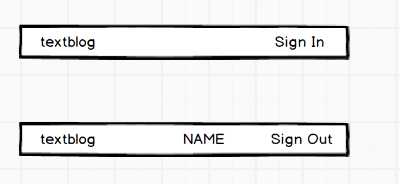
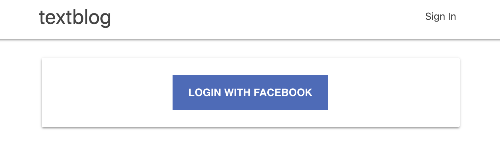
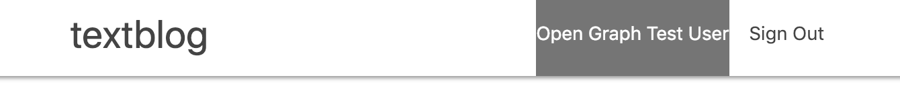

# Adding Sign In to React

This document explains steps to make sign in/sign out to work on ReactJS which needs
OAuth by Facebook.
When all steps in this document are completed, the entire repository will look like this
__[textblog repo]()__ (the repository at this point in the history).

This document assumes following three are already completed.
- OAuth by Facebook is setup and works
(see [Setting Up Facebook Login](./SettingUpFacebookLogin.md)).
- On Insomnia (GraphQL IDE), user's information can be pulled using access token, which is stored
in `window.localStorage[_textblog:access_toekn]`
(see [Using OAuth On GraphQL](./UsingOAuthOnGraphQL.md)).
- The textblog top page has "sign in" link on the top nav bar
(see [Creating Top Page](./CreatingTopPage.md)).

1. Nav bar design and story

    This document starts off to think about what should be done on the Nav bar.
    The story will be:

    - At the beginning, a user has not yet signed in. So, no username and sign in
    link are on the nav bar.
    - Once a user completes a sign in sequence, the username and sign out link
    are on the nav bar.

    The Nav bar should look like:
    

2. Create Sign In page

    The story here is: when a user clicks "Sign In" link, a sign in page shows up.
    The page has social login buttons (so far, only Facebook button).
    Once, the user completes OAuth authentication (social login), the page will be
    back to a main page (post list).
    
    - Create `app/javascript/packs/components/SignIn.jsx` file
    
        `FacebookLoginButton` is a React component created previously
        (see [Using OAuth on GraphQL](./UsingOAuthOnGraphQL.md)).
        ```javascript
        import React, { Component } from 'react'
        import FacebookLoginButton from './FacebookLoginButton'
        
        class SignIn extends Component {
          render () {
            let styles = {
              marginTop: '20px'
            }
        
            return (
              <div className="row" style={styles}>
                <div className="col s12 m12">
                  <div className="card-panel white">
                    <div  className="sign_in_container">
                      <FacebookLoginButton/>
                    </div>
                  </div>
                </div>
              </div>
            )
          }
        }
        
        export default SignIn
        ```
    - Add some style
        Open `app/assets/stylesheets/home.scss` and add `.sign_in_container`.
        ```css
        ....
        ....
        .sign_in_container {
          display: flex;
          justify-content: center;
          align-items: center;
        }
        ```
3. Create a route to Sign In page

    To show the Sign In page, it needs a route to Sign In page.
    This route definition is done only on React side.
    - Define a route in `Main` component
        Open `app/javascript/packs/components/Main.jsx` and add a line
        `<Route path="/sign_in" component={SignIn} />`
        ```javascript
        import React, { Component } from 'react'
        import { Switch, Route } from 'react-router-dom'
        import PostList from './PostList'
        import SignIn from './SignIn'
        
        class Main extends Component {
          render() {
            return (
              <div className="container">
                <Switch>
                  <Route exact path="/" component={PostList} />
                  <Route path="/sign_in" component={SignIn} />
                </Switch>
              </div>
            )
          }
        }
        
        export default Main
        ```
    - Change link to page
        For now, Nav bar's Sign In link got a real destination.
        Open `app/javascript/packs/components/NavBar.jsx` and change "to"
        attribute like: `<li><Link to="/sign_in">Sign In</Link></li>`
        ```javascript
        import React, { Component } from 'react'
        import { Link } from 'react-router-dom'
        
        class NavBar extends Component {
          render () {
            return (
              <div className="navbar-fixed">
                <nav className="white">
                  <div className="nav-wrapper container">
                    <Link id="logo-container" to="/" className="brand-logo left">textblog</Link>
                    <ul id="nav-mobile" className="right">
                      <li><Link to="/sign_in">Sign In</Link></li>
                    </ul>
                  </div>
                </nav>
              </div>
            )
          }
        }
        
        export default NavBar
        ```
        When those route settings are finished and Sign In link is clicked,
        the facebook button should show up.
        
        

4. Update Rails routes

    Now, the app got a new route, http://localhost:3000/sign_in. This route is a client
    side route, so Rails doesn't know at all. If someone hits the sign_in URL on the browser,
    the request goes to Rails. The result is an error. To avoid this, add 'all other' path
    to Rails.
    
    - Define all other path
    
        Open `config/routes.rb` and add below to the end of route definitions.
        ```ruby
        Rails.application.routes.draw do
          ....
          ....
          # for all other routes
          get '*path', to: 'home#index'
        end
        ```

5. Add Redux package

    Redux is a micro framework for a state management on the client side.

    The state of a user (signed in or not) will be used by a couple of React components.
    At this moment, the nav bar is only one, however, later, components for
    create/update/delete post features will be added.
    In such a case, the state of the user (signed in or not, who) is required.

    Among various ways to manage the state, Redux would be the most popular framework.
    That's the reason Redux was chosen here.

    - Add `redux` and `react-redux` packages

        `yarn add redux react-redux`

6. Create Redux action

    Redux's state management is done by action, reducer and store.
    Among three, the action comes first to define in terms of Redux practice.
    Here, the action will be created.
    
    - Create a directory and constants file for action

        Redux action always emits an action type. It is just a string.
        Writing a string value is often a source of bug since it is typo-ed
        easily and hard to find. As a Redux practice, the action type is
        declared as a constant. The constants are often put together in one file.
        Following such practice, let's create a constant file and define the action type.
                
        ```
        mkdir -p app/javascript/packs/constants/
        touch app/javascript/packs/constants/actions.js
        ```
        ```javascript
        export const UPDATE_SOCIAL_LOGIN = 'UPDATE_SOCIAL_LOGIN'
        ```

    - Create a directory and action file
        ```bash
        mkdir -p app/javascript/packs/actions
        touch app/javascript/packs/actions/index.js
        ```
        Redux's action is just a normal JavaScript file, so the extension is `.js`.
        ```javascript
        import {
          UPDATE_SOCIAL_LOGIN
        } from '../constants/actions'
        
        export const updateFacebookLogin = (response) => {
          let user = {
            access_token: response.accessToken,
            uid: response.userID,
            name: response.name,
            email: response.email
          }
          console.log('action')
          return {
            type: UPDATE_SOCIAL_LOGIN,
            provider: 'facebook',
            user
          }
        }
        ```

7. Create Redux reducer

    The second to create in Redux is a reducer. The reducer exists to update
    a state, which is a plain JavaScript object. Redux never mutates the state
    object. Because of this policy, next state (a new JavaScript object) will be
    returned.
    
    - Create a directory and reducer file
        ```
        mkdir -p app/javascript/packs/reducers
        touch app/javascript/packs/reducers/index.js
        ```
        ```javascript
        import { UPDATE_SOCIAL_LOGIN } from '../constants/actions'
        
        const initialState = {
          provider: '',
          user: null,
        }
        
        const updateUser = (state = initialState, action) => {
          switch (action.type) {
            case UPDATE_SOCIAL_LOGIN:
              return {
                ...state,
                provider: action.provider,
                user: action.user
              }
            default:
              return state
          }
        }
        
        export default updateUser
        ```

8. Create Redux store

    The last piece of Redux is a store. This is where a state is stored and shared across
    React components.
    
    Open `app/javascript/packs/index.jsx` and add lines of code as in below.
    This code includes log output to JavaScript console.
    ```javascript
    import React from 'react'
    import ReactDOM from 'react-dom'
    import ApolloClient from 'apollo-boost'
    import { ApolloProvider } from 'react-apollo'
    import { BrowserRouter as Router } from 'react-router-dom'
    import { Provider } from 'react-redux'
    import { createStore, applyMiddleware } from 'redux'
    import App from './components/App'
    import reducer from './reducers'
    
    const client = new ApolloClient({uri: window.location.origin + "/graphql"});
    
    const logger = store => next => action => {
      console.group(action.type)
      console.info('dispatching', action)
      let result = next(action)
      console.log('next state', store.getState())
      console.groupEnd(action.type)
      return result
    }
    const store = createStore(reducer, applyMiddleware(logger))
    
    const Root = props => {
      return (
        <ApolloProvider client={client}>
          <Provider store={store}>
            <Router><App /></Router>
          </Provider>
        </ApolloProvider>
      )
    }
    
    document.addEventListener('DOMContentLoaded', () => {
      ReactDOM.render(
        <Root />,
        document.body.appendChild(document.createElement('div')),
      )
    })
    ```

9. Update `FacebookLoginButton`

    The `FacebookLoginButton` component is a source of action.
    When the component's callback function gets called,
    Redux action will be emit, then the reducer updates the Redux state.
    
    After adding Redux code, the component turns to below:
    ```javascript
    import React, { Component } from 'react'
    import { Redirect } from 'react-router'
    import PropTypes from 'prop-types'
    import { connect } from 'react-redux'
    import FacebookLogin from 'react-facebook-login'
    import { updateFacebookLogin } from '../actions'
    
    class FacebookLoginButton extends Component {
      responseFacebook = (response) => {
        this.props.updateFacebookLogin(response)
      }
    
      render() {
        const { access_token } = this.props
        if (access_token) {
          return (
            <Redirect to="/" />
          )
        } else {
          return (
            <FacebookLogin
              appId="2334273453512956"
              autoLoad={true}
              fields="id,name,email"
              callback={this.responseFacebook}
            />
          )
        }
      }
    }
    
    FacebookLoginButton.propTypes = {
      access_token: PropTypes.string.isRequired,
      updateFacebookLogin: PropTypes.func.isRequired,
    }
    
    const mapStateToProps = state => ({
      access_token: state.user ? state.user.access_token : '',
    })
    const mapDispatchToProps = dispatch => ({
      updateFacebookLogin: (response) => dispatch(updateFacebookLogin(response))
    })
    
    export default connect(mapStateToProps, mapDispatchToProps)(FacebookLoginButton)
    ```
    
10. Update `NavBar` component

    The state update done by the reducer is used in `NavBar` React component.
    If user is in the state, the user name will show up. Also, "Sign In" will be
    replaced by "Sign Out" link. At this moment, "Sign Out" link does nothing, but
    the change can be seen.
    
    Open `app/javascript/packs/components/NavBar.jsx` and add code as in below:
    ```javascript
    import React, { Component } from 'react'
    import { Link } from 'react-router-dom'
    import PropTypes from 'prop-types'
    import { connect } from 'react-redux'
    
    class NavBar extends Component {
      render () {
        const { access_token, name } = this.props
        let nameContent
        let linkContent
        if (name) {
          nameContent =
            <li className="grey darken-1">{name}</li>
          linkContent = <li><Link to="/">Sign Out</Link></li>
        } else {
          nameContent = <li></li>
          linkContent = <li><Link to="/sign_in">Sign In</Link></li>
        }
        return (
          <div className="navbar-fixed">
            <nav className="white">
              <div className="nav-wrapper container">
                <Link id="logo-container" to="/" className="brand-logo left">textblog</Link>
                <ul id="nav-mobile" className="right">
                  {nameContent}
                  {linkContent}
                </ul>
              </div>
            </nav>
          </div>
        )
      }
    }
    
    NavBar.propTypes = {
      access_token: PropTypes.string.isRequired,
      name: PropTypes.string.isRequired,
    }
    
    const mapStateToProps = state => ({
      access_token: state.user ? state.user.access_token : '',
      name: state.user ? state.user.name : '',
    })
    
    export default connect(mapStateToProps, null)(NavBar)
    ```
    
11. Test Sign In

    Go to http://localhost:3000 and click "Sign In" link.
    After going over OAuth sequence, the page will be redirected to the home.
    Now, the Nav bar should have the name as in the picture below.
    
    
    
For now, textblog app was confirmed to manage User sign in. Also, the app can show
a list of posts. Next topic is about [Testing GraphQL](./TestingGraphQL.md)
