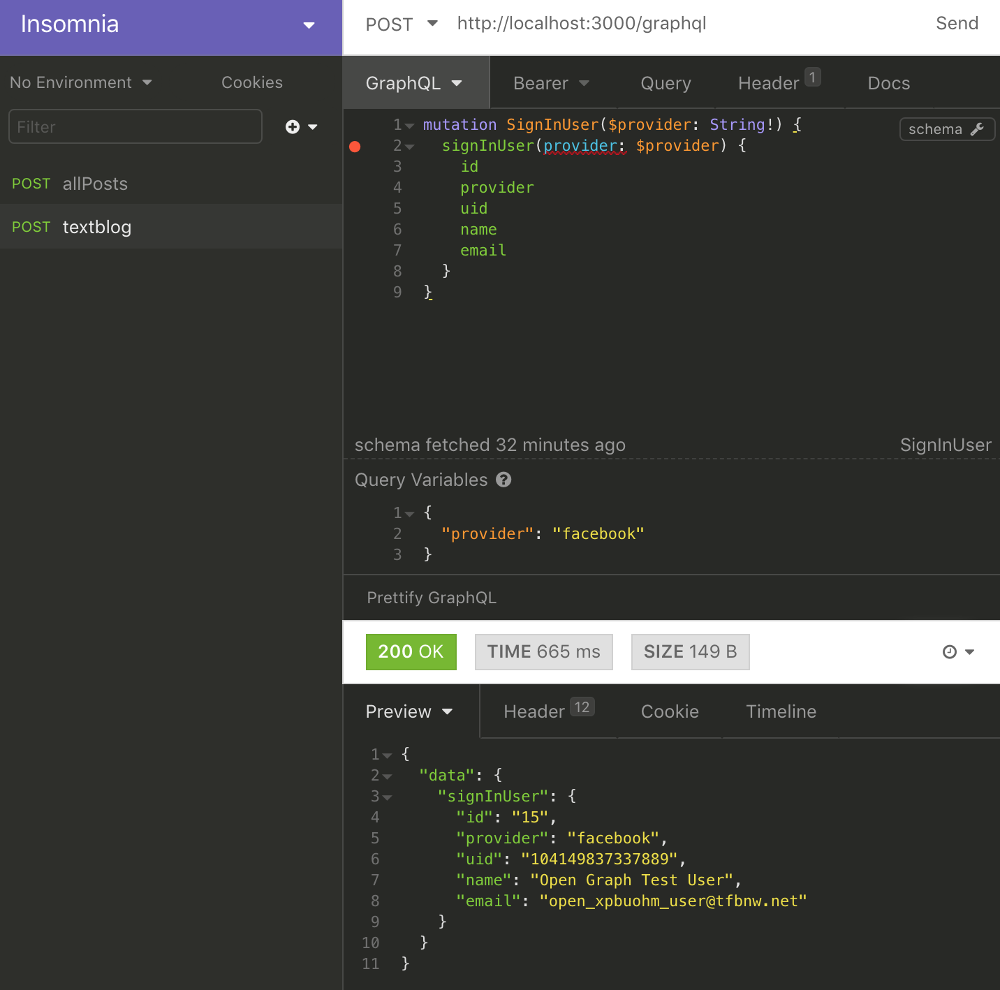

# Connecting React Sign In to GraphQL

This document explains steps to connect React component with Redux state management to GraphQL.
When all steps in this document are completed, the entire repository will look like this
__[textblog repo]()__
(the repository at this point in the history).

So far, only on the client side, Facebook Login is working. The client has a user's access token
and other info in Redux store. A state transition is working as expected on UI.
However, at this moment, the Rails app has no idea whether the user finished 'Sign In' process
or not. The sign-ed in user may or may not exist on the server side.

Here, GraphQL `signInUser` mutation will be connected to a React component.
The Rails app will receive sign in request. Once Rails gets sign in request,
the server will find or create a user on the server side, then return the user info.

1. Clean up and improve GraphQL mutation

    The GraphQL mutation has a couple of schema definitions created by the steps in the doc,
    [Adding GraphQL](./AddingGraphQL.md). Since OAuth based user creation has been added,
    those user management mutations became out-of-date features. Here, delete those schemas.
    The `signInUser` mutation will be in the schema file.
    
    Another to be done here is an improvement to support multiple OAuth providers. For a
    moment, this app will go only by Facebook Login, but is planning to add other
    social logins. Here, change some files to make those provider independent.
    
    - Delete mutation schemas, which won't use anymore

        Open `app/graphql/types/mutation_type.rb` and delete createUser/updateUser/deleteUser
        mutations. Then, add `provider` as an argument of `signInUser` mutation.
        ```ruby
        Types::MutationType = GraphQL::ObjectType.define do
          name "Mutation"
        
          field :signInUser, Types::UserType do
            argument :provider, !types.String
            resolve -> (obj, args, ctx) {
              access_token, social_api = ctx[:api][:access_token], ctx[:api][:social_api]
              if access_token.nil?
                raise GraphQL::ExecutionError.new('Authorization request header is missing.')
              end
              if social_api.nil?
                raise GraphQL::ExecutionError.new('Authorization request header is invalid.')
              end
              begin
                # this works only for facebook at this moment
                # later other social logins will be added
                me = social_api.get_object('me', {'fields': 'id,name,email'}) # this line may raise error
                User.where(provider: args[:provider], uid: me['id']).first_or_create do |user|
                  user.name = me['name']
                  user.email = me['email']
                end
              rescue => e
                GraphQL::ExecutionError.new(e.message)
              end
            }
          end
        end
        ```
    - Update `graphql_helper.rb`

        The main changes here is to use a provider variable.
        Open `app/helpers/graphql_helper.rb` and edit. The file should look like:
        ```ruby
        module GraphqlHelper
          def get_api(request, variables)
            access_token = get_access_token(request)
            social_api = get_social_api(access_token, variables)
            {access_token: access_token, social_api: social_api}
          end
        
          private
          def get_access_token(request)
            auth_header = request.headers["authorization"]
            if auth_header
              values = auth_header.split(' ')
              values.length == 2 && values.first == 'Bearer' ? values.last : nil
            else
              nil
            end
          end
        
          def get_social_api(access_token, variables)
            if access_token.nil?
              return nil
            end
            if variables[:provider] == 'facebook'
              Koala::Facebook::API.new(access_token)
            else
              nil
            end
          end
        end
        ```
    - Update `graphql_controller.rb`
    
        Now, the helper method, `get_api`, takes `variables` as another argument.
        The controller got an only one change -- helper method argument.
        
        Open `app/controllers/graphql_controller.rb` and add an argument to
        `get_api` method.
        ```ruby
        class GraphqlController < ApplicationController
          include GraphqlHelper
        
          skip_before_action :verify_authenticity_token
        
          def execute
            ....
            context[:api] = get_api(request, variables)
            result = TextblogSchema.execute(query, variables: variables, context: context, operation_name: operation_name)
            ....
            ....
          end
          ....
          ....
        end
        ```

2. Test updated GraphQL mutation

    The `signInUser` mutation needs an access token. Grab that from JavaScript console.
    Once 'Sign In' link gets clicked on the top page, the value is printed
    in the JavaScript console.
    
    - Set access token
    
        
    - Write mutation and variable
    
        This time, a parameter is passed as a variable instead of hard coded.
        The mutation will be:
        ```javascript
        mutation SignInUser($provider: String!) {
          signInUser(provider: $provider) {
            id
            provider
            uid
            name
            email
          }
        }
        ```
        The variable will be:
        ```javascript
        {
          "provider": "facebook"
        }
        ```
        When the 'Send' link gets clicked with the schema and variable, it shows the
        result of a user info.
        
         

3. Add a new Redux action/reducer

4. Create a `User` React component

5. Update `NavBar`

6. Test and check JavaScript console

    
For now, textblog app was confirmed to work with React. Next topic is
about []().
