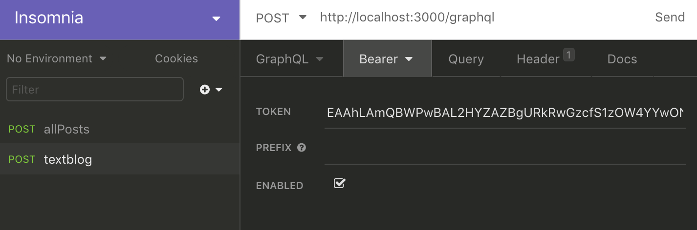
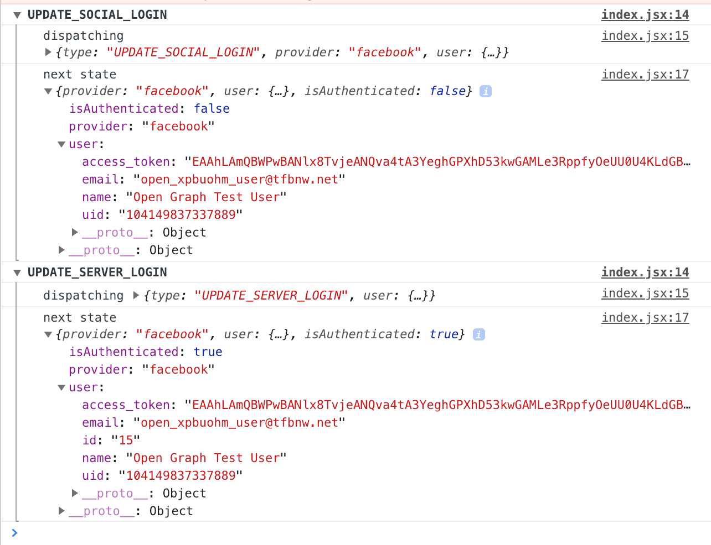
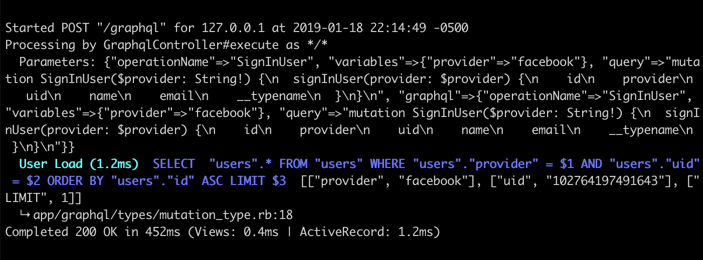

# Connecting React Sign In to GraphQL

This document explains steps to connect React component with Redux state management to GraphQL.
When all steps in this document are completed, the entire repository will look like this
__[textblog repo](https://github.com/yokolet/textblog/tree/6dd1396df388346e82070e0a4069d5371a617dc4)__
(the repository at this point in the history).

So far, only on the client side, Facebook Login is working. The client has a user's access token
and other info in Redux store. A state transition is working as expected on UI.
However, at this moment, the Rails app has no idea whether the user finished 'Sign In' process
or not. The sign-ed in user may or may not exist on the server side.

Here, GraphQL `signInUser` mutation will be connected to a React component.
The Rails app will receive sign in request. Once Rails gets sign in request,
the server will find or create a user on the server side, then return the user info.

1. Clean up and improve GraphQL mutation

    The GraphQL mutation has a couple of schema definitions created by the steps in the doc,
    [Adding GraphQL](./AddingGraphQL.md). Since OAuth based user creation has been added,
    those user management mutations became out-of-date features. Here, delete those schemas.
    The `signInUser` mutation will be in the schema file.

    Another to be done here is an improvement to support multiple OAuth providers. For a
    moment, this app will go only by Facebook Login, but is planning to add other
    social logins. Here, change some files to make those provider independent.

    - Delete mutation schemas, which won't use anymore

        Open `app/graphql/types/mutation_type.rb` and delete createUser/updateUser/deleteUser
        mutations. Then, add `provider` as an argument of `signInUser` mutation.
        ```ruby
        Types::MutationType = GraphQL::ObjectType.define do
          name "Mutation"

          field :signInUser, Types::UserType do
            argument :provider, !types.String
            resolve -> (obj, args, ctx) {
              access_token, social_api = ctx[:api][:access_token], ctx[:api][:social_api]
              if access_token.nil?
                raise GraphQL::ExecutionError.new('Authorization request header is missing.')
              end
              if social_api.nil?
                raise GraphQL::ExecutionError.new('Authorization request header is invalid.')
              end
              begin
                # this works only for facebook at this moment
                # later other social logins will be added
                me = social_api.get_object('me', {'fields': 'id,name,email'}) # this line may raise error
                User.where(provider: args[:provider], uid: me['id']).first_or_create do |user|
                  user.name = me['name']
                  user.email = me['email']
                end
              rescue => e
                GraphQL::ExecutionError.new(e.message)
              end
            }
          end
        end
        ```
    - Update `graphql_helper.rb`

        The main changes here is to use a provider variable.
        Open `app/helpers/graphql_helper.rb` and edit. The file should look like:
        ```ruby
        module GraphqlHelper
          def get_api(request, variables)
            access_token = get_access_token(request)
            social_api = get_social_api(access_token, variables)
            {access_token: access_token, social_api: social_api}
          end
        
          private
          def get_access_token(request)
            auth_header = request.headers["authorization"]
            if auth_header
              values = auth_header.split(' ')
              values.length == 2 && values.first == 'Bearer' ? values.last : nil
            else
              nil
            end
          end

          def get_social_api(access_token, variables)
            if access_token.nil?
              return nil
            end
            if variables[:provider] == 'facebook'
              Koala::Facebook::API.new(access_token)
            else
              nil
            end
          end
        end
        ```
    - Update `graphql_controller.rb`

        Now, the helper method, `get_api`, takes `variables` as another argument.
        The controller got an only one change -- helper method argument.

        Open `app/controllers/graphql_controller.rb` and add an argument to
        `get_api` method.
        ```ruby
        class GraphqlController < ApplicationController
          include GraphqlHelper
        
          skip_before_action :verify_authenticity_token
        
          def execute
            ....
            context[:api] = get_api(request, variables)
            result = TextblogSchema.execute(query, variables: variables, context: context, operation_name: operation_name)
            ....
            ....
          end
          ....
          ....
        end
        ```

2. Test updated GraphQL mutation

    The `signInUser` mutation needs an access token. Grab that from JavaScript console.
    Once 'Sign In' link gets clicked on the top page, the value is printed
    in the JavaScript console.

    - Set access token

        
    - Write mutation and variable

        This time, a parameter is passed as a variable instead of hard coded.
        The mutation will be:
        ```javascript
        mutation SignInUser($provider: String!) {
          signInUser(provider: $provider) {
            id
            provider
            uid
            name
            email
          }
        }
        ```
        The variable will be:
        ```javascript
        {
          "provider": "facebook"
        }
        ```
        When the 'Send' link gets clicked with the schema and variable, it shows the
        result of a user info.

         

3. Add a new Redux action/reducer

    Once the `signInUser` mutation is added to the React app, the story will be
    changed to: only when a signed in user is checked in to the server,
    the user's name appears on the Nav bar.

    To make this happen, let's add one more Redux state, `isAuthenticated`. It is one of
    the state Redux manages, so to update the value, another action/reducer should be
    added.

    The new action is named `UPDATE_SERVER_LOGIN`.

    - Add a new constant

        Open `app/javascript/packs/constants/actions.js` and add `UPDATE_SERVER_LOGIN`
        as a new action.
        ```javascript
        export const UPDATE_SOCIAL_LOGIN = 'UPDATE_SOCIAL_LOGIN'
        export const UPDATE_SERVER_LOGIN = 'UPDATE_SERVER_LOGIN'
        ```

    - Add a new action `updateServerLogin`

        Open `app/javascript/packs/actions/index.js` and add a new constant in import and
        function.
        ```javascript
        import {
          UPDATE_SOCIAL_LOGIN,
          UPDATE_SERVER_LOGIN
        } from '../constants/actions'
        ....
        ....

        export const updateServerLogin = (data) => {
          return {
            type: UPDATE_SERVER_LOGIN,
            user: data.signInUser
          }
        }
        ```
        As in the picture above, the mutation returns the object:
        ```javascript
        {
          "data": {
            "signInUser": {
              "id": 15,
              ....
              ....
            }
          }
        }
        ```
        That's why `user: data.signInUser` is there.

    - Update reducer to handle the new action

        Open `app/javascript/packs/reducers/index.js` and add the case `UPDATE_SERVER_LOGIN`.
        Notice, `isAuthenticated: false` is added to the initialState.
        ```javascript
        import {
          UPDATE_SOCIAL_LOGIN,
          UPDATE_SERVER_LOGIN,
        } from '../constants/actions'

        const initialState = {
          provider: '',
          user: null,
          isAuthenticated: false
        }

        const updateUser = (state = initialState, action) => {
          switch (action.type) {
            case UPDATE_SOCIAL_LOGIN:
              return {
                ...state,
                provider: action.provider,
                user: action.user
              }
            case UPDATE_SERVER_LOGIN:
              return {
                ...state,
                user: {
                  ...state.user,
                  id: action.user.id,
                },
                isAuthenticated: action.user && action.user.id ? true : false
              }
            default:
              return state
          }
        }
        
        export default updateUser
        ```

4. Create a `User` React component

    The `User` component is responsible to show a user name. This component provides
    tiny portion of view, however, its role is big. The following is what the `User`
    component does.

    1. When the values of Redux store are updated, the `User` component catches it.
    2. If the user has not yet been authenticated, GraphQL mutation will be sent out
    to the Rails server (the user will be created if he/she isn't on the database).
    3. Once a GraphQL response is back, the component calls Redux action.
    4. The action calling triggers the reducer to update the state. In this phase,
    the user becomes authenticated.
    5. The component renders the user name since the user is authenticated.

    Below is the entire code of `app/javascript/packs/components/User.jsx`.
    ```javascript
    import React, { Component } from 'react'
    import PropTypes from 'prop-types'
    import { compose } from 'redux'
    import { connect } from 'react-redux'
    import gql from 'graphql-tag'
    import { graphql } from 'react-apollo'
    import { updateServerLogin } from "../actions";
    
    class User extends Component {
      constructor(props) {
        super(props)
        this.handleLoad = this.handleLoad.bind(this)
      }
    
      componentDidMount() {
        window.addEventListener('load', this.handleLoad)
      }
    
      componentDidUpdate(prevProps, prevState, snapshot) {
        this.handleLoad()
      }
    
      handleLoad() {
        const { access_token, isAuthenticated } = this.props
        if (access_token && isAuthenticated === false) {
          const { mutate, provider, updateServerLogin } = this.props
          mutate({
            variables: { provider },
            context: { headers: { authorization: `Bearer ${access_token}` } }
          })
            .then(({ data }) => {
              updateServerLogin(data)
            })
        }
      }
    
      render () {
        if (this.props.isAuthenticated) {
          const { user_id, name } = this.props
          return (
            <li key={user_id} className="grey darken-1">{name}</li>
          )
        } else {
          return (
            <li></li>
          )
        }
      }
    }
    
    const signInUser = gql`
      mutation SignInUser($provider: String!) {
        signInUser(provider: $provider) {
          id
          provider
          uid
          name
          email
        }
      }
    `

    const gqlWrapper = graphql(signInUser)

    User.propTypes = {
      isAuthenticated: PropTypes.bool,
      access_token: PropTypes.string.isRequired,
      name: PropTypes.string.isRequired,
      user_id: PropTypes.string
    }
    
    const mapStateToProps = state => ({
      provider: state.provider,
      access_token: state.user ? state.user.access_token : '',
      user_id: state.user ? state.user.id : '',
      name: state.user ? state.user.name : '',
      isAuthenticated: state.isAuthenticated
    })
    
    const mapDispatchToProps = dispatch => ({
      updateServerLogin: (user) => dispatch(updateServerLogin(user))
    })
    
    const reduxWrapper = connect(mapStateToProps, mapDispatchToProps)
    export default compose(reduxWrapper, gqlWrapper)(User)
    ```
    The last two lines combines Redux and Apollo (GraphQL lib) by Redux `compose`.
    This is why `this.props` has `mutate`, which is used in `handleLoad` function.

5. Update `NavBar`

    For now, `NavBar` uses `User` component to show the user name. Some lines were
    replaced by the `User` component. Also, the state to know sign in or out has been
    changed to isAuthenticated. This state is more meaningful to judge this.
    
    Open `app/javascript/packs/components/NavBar.jsx` and edit. The component should
    look like:
    ```javascript
    import React, { Component } from 'react'
    import { Link } from 'react-router-dom'
    import PropTypes from 'prop-types'
    import { connect } from 'react-redux'
    import User from './User'
    
    class NavBar extends Component {
      render () {
        const { isAuthenticated } = this.props
        let linkContent
        if (isAuthenticated) {
          linkContent = <li><Link to="/">Sign Out</Link></li>
        } else {
          linkContent = <li><Link to="/sign_in">Sign In</Link></li>
        }
        return (
          <div className="navbar-fixed">
            <nav className="white">
              <div className="nav-wrapper container">
                <Link id="logo-container" to="/" className="brand-logo left">textblog</Link>
                <ul id="nav-mobile" className="right">
                  <User/>
                  {linkContent}
                </ul>
              </div>
            </nav>
          </div>
        )
      }
    }
    
    NavBar.propTypes = {
      isAuthenticated: PropTypes.bool
    }
    
    const mapStateToProps = state => ({
      isAuthenticated: state.isAuthenticated
    })
    
    export default connect(mapStateToProps, null)(NavBar)
    ```

6. Test and check JavaScript console

    Open JavaScript console and request http://localhost:3000.
    At this moment, a user name isn't on the nav bar.
    Click `Sign In` link and see what happens.

    After Facebook login sequence, the user name shows up in the nav bar.

    Take a look at a JavaScript console.

    

    Two actions, `UPDATE_SOCIAL_LOGIN` and `UPDATE_SERVER_LOGIN` were printed out.
    The first one, `UPDATE_SOCIAL_LOGIN`, was an update by a client side only social login.
    The React app performed Facebook Login, then got an access token and user info.
    The Redux state was updated by the info from Facebook.

    The second action, `UPDATE_SERVER_LOGIN`, was an update by signInUser GraphQL mutation.
    The result got back from Rails server. The `uid` is a user id on Facebook, while `id` is
    the id of `User` model on Rails. The Redux state was updated by the info sent from Rails server.

    Take a look at the terminal where Rails is running.

    

    Above shows GraphQL mutation came in, then a query to the database
    happened. In this case, the user was already created on Rails side,
    so it was the query.
    If the user didn't exist on the database, the Rails app would have
    created the user.

    To conclude, the user authentication steps are:
    1. React app gets an access token by Facebook Login
    2. React app sends a provider name in the body and access token in the header to Rails server
    3. Rails server makes request to Facebook API endpoint with the access token
    4. Rails server gets the user info from Facebook
    5. Rails server finds or create the user
    6. Rails server sends back the user info
    7. React app gets an additional user info

    In the end, the React app and Rails server are on the same page.
    
For now, textblog app was confirmed to work with a social login
using Redux and GraphQL mutation.
Next topic is about [Testing GraphQL](./TestingGraphQL.md).
