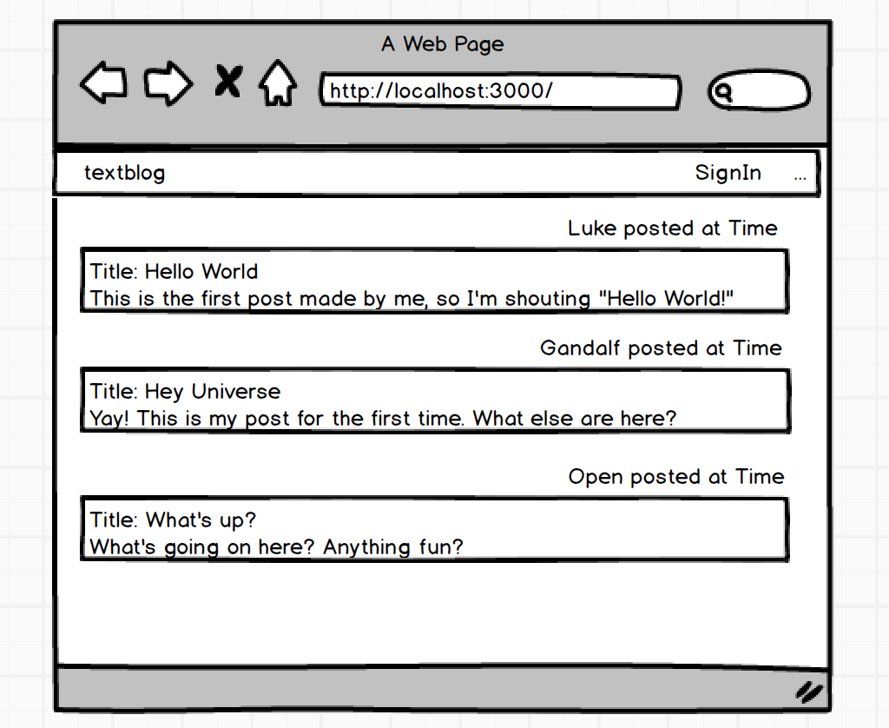
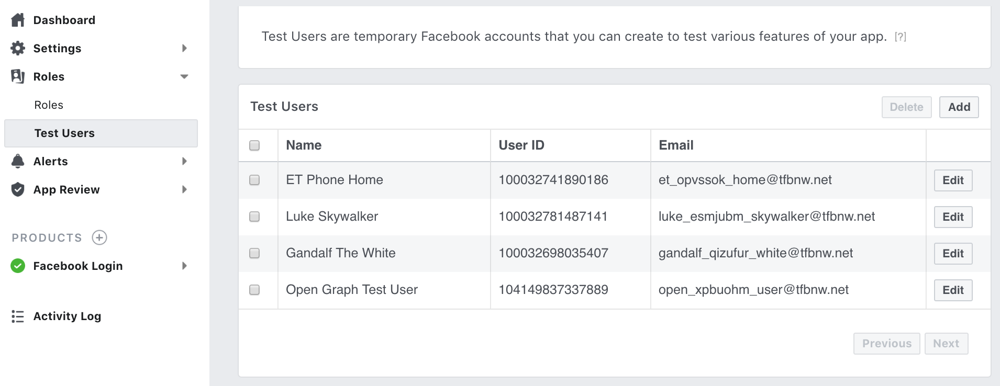
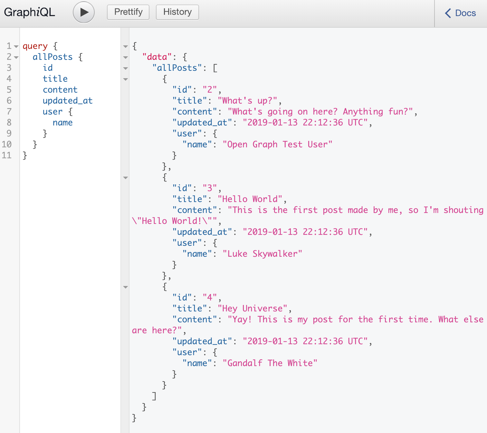
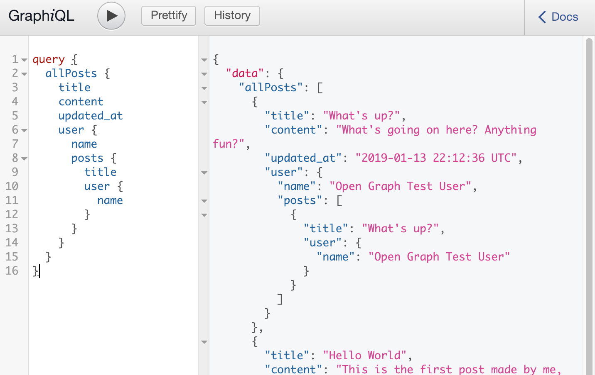
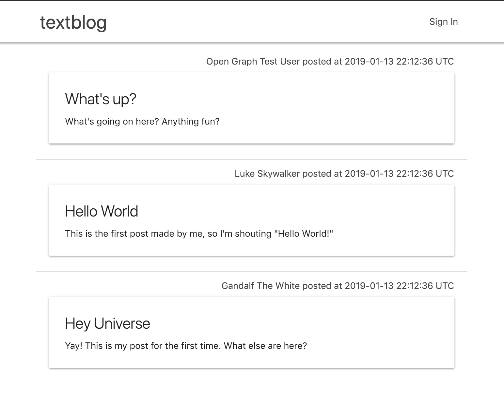

# Creating a Top Page

This document explains steps to create a top page along with making GraphQL query
to get data.
When all steps in this document are completed, the entire repository will look like this
__[textblog repo](https://github.com/yokolet/textblog/tree/976edb8e9b22463f291c5335a6b61fc1858e7292)__
(at this point in the history).

Going over all previous documents, very basic features by ReactJS, GraphQL and OAuth
are conformed to work.
Here, a realistic UI will be created.

1. Top page design and story

    Before changing code, make sure what the top page looks like.
    Still, to keep it simple, the top page design is a simple one as in the
    picture below.

    

    - The page has Sign In link (in this document, just a dummy link)
    - The page has multiple posts
    - To look at the posts (people don't need to sign in)
    - Each post has a title, content, user and updated time

    Later, sign in and write/edit/delete post features will be added.

2. Create multiple test users

    To make this app more realistic, let's add Facebook authenticate-able users.
    In this app, all users should be created by a given access token.
    So, add more users at Facebook developer website.
    
    
    
    At this moment, the sign in feature is not connected from ReactJS to Rails server.
    Create a user by making GraphQL mutation on Insomnia described in
    [Using OAuth on GraphQL](./UsingOAuthOnGraphQL.md).

3. Create a Post model and seed data

    For now, all posts will be created by seeding. Later, write/edit/delete feature will be
    added since those should be done by a signed in user.
    
    - Create a Post model
    
        The Post model has a title, content (created/updated time are automatically
        created by Rails). Additionally, associations -- a post belongs to a user,
        and a user has many posts -- should be created.
        
        `rails g model Post title:string content:text user:references`
        
        `rails db:migrate`
        
        Each post's title and content should not be empty, so adds validation.
        Open `app/models/post.rb` and add a line `validates_presence_of :title, :content`.
        ```ruby
        class Post < ApplicationRecord
          validates_presence_of :title, :content
          belongs_to :user
        end
        ```
        
    - Add has_many association to User
    
        Open `app/models/user.rb` and add a line `has_many :posts`.
        ```ruby
        class User < ApplicationRecord
          # Include devise modules.
          devise :omniauthable, omniauth_providers: [:facebook]
          # validation
          validates_presence_of :name, :email
          # Association
          has_many :posts
        
          def self.from_omniauth(auth)
            where(provider: auth.provider, uid: auth.uid).first_or_create do |user|
              user.email = auth.info.email
              user.name = auth.info.name
            end
          end
        end
        ```

    - Create seed data
    
        Users were already created manually calling `singInUser` GraphQL mutation
        using OAuth access token for user information. The seed will create posts
        tied to those users.
        
        Edit `db/seeds.rb` to replace all by following:
        ```ruby
        user_ids = User.ids
        posts = [
            {title: "What's up?",content: "What's going on here? Anything fun?"},
            {title: "Hello World", content: 'This is the first post made by me, so I\'m shouting "Hello World!"'},
            {title: "Hey Universe", content: "Yay! This is my post for the first time. What else are here?"}
        ]
        posts.each_with_index do |post, idx|
          User.find(user_ids[idx]).posts.create(post)
        end
        ```
        
        `rails db:seed`

4. Define and Update GraphQL schema

    - Define Post schema
    
        The Post model is newly added on the Rails side, so let's define PostType
        GraphQL schema first. Create a file `app/graphql/types/post_type.rb`. This
        looks like following:
        ```ruby
        Types::PostType = GraphQL::ObjectType.define do
          name "Post"
        
          field :id, !types.ID
          field :title, !types.String
          field :content, !types.String
          field :updated_at, !types.String
          field :user, !Types::UserType
        end
        ```
        
        Field names above are corresponding to the methods names Post instance has.

    - Update User schema
    
        Now, a user can have multiple posts. Open `app/graphql/types/user_type.rb`
        and add a line `field :posts, types[Types::PostType]`.
        ```ruby
        Types::UserType = GraphQL::ObjectType.define do
          name "User"
        
          field :id, !types.ID
          field :provider, !types.String
          field :uid, !types.ID
          field :name, !types.String
          field :email, !types.String
          field :posts, types[Types::PostType]
        end
        ```

    - Add `allPosts` query type
    
        The last schema to be updated is query type. Open `app/graphql/types/query_type.rb`
        and add `allPosts` field. 
        ```ruby
        Types::QueryType = GraphQL::ObjectType.define do
          name "Query"    
          ....
          ....    
          field :allPosts do
            type types[Types::PostType]
            description "returns a list of all posts"
            resolve -> (obj, args, ctx) {
              Post.all
            }
          end
        end
        ```

5. Test GraphQL query

    Use either of GraphiQL or Insomnia to test GraphQL query. Notice, on Insomnia,
    schema is updated only when "Refresh Schema" is clicked.
    As in the mock image of top page, id, title, content and updated_at from PostType and
    name from UserType are all needed here.
    
    The query is:
    ```
    query {
      allPosts {
        id
        title
        content
        updated_at
        user {
          name
        }
      }
    }
    ```
    Above query returns allPost along with user name.
    
    
    - Anecdote
    
        A GraphQL allows an infinitely nested query. For example,
        ```
        query {
          allPosts {
            title
            content
            updated_at
            user {
              name
              posts {
                title
                user {
                  name
                }
              }
            }
          }
        }
        ```
        works without any issue. The result will be:
        

6. Install `materialize-sass` gem

    For a front-end framework, this app will use materialize-sass gem.
    This gem is a Rails integration of [Materialize](https://materializecss.com/).
    Materialize is a lightweight framework and doesn't require much to create a page.
    
    - Add the gem to `Gemfile`.
        ```ruby
        # Use Materialize sass for a front-end framework
        gem 'materialize-sass', '~> 1.0'
        ```
        
        `bundle install`

    - Delete `application.css` and create `application.scss`

        Delete
        `app/assets/stylesheets/application.css`,
        then create
        `app/assets/stylesheets/application.scss`
        with the content below:
        ```css
        @import "https://fonts.googleapis.com/icon?family=Material+Icons";
        @import 'materialize';
        
        @import "home";
        ```
        The last line is to import `home.scss`, which was created along with
        home controller (see [Adding React](./AddingReact.md)).
        
7. Install `react-router-dom` package

    For a front-end routing, install `react-router-dom` package. This is not like
    Rails side routing, page navigations happen only on the client side. For example,
    back to top page, or show post edit page.
    
    `yarn add react-router-dom`

8. Create React Components

    To make the web page as in the mock image, the app need a couple of React Components.
    
    - Create `PostList` component
    
        This is a component to show posts. The component makes GraphQL query and
        renders the result. Styling is done by Materialize. Basically, the component
        does the same as `UserList` created in the document, [Using GraphQL from React](./UsingGraphQLfromReact.md).
        ```javascript
        import React, { Component } from 'react'
        import gql from 'graphql-tag'
        import { graphql } from 'react-apollo'
        
        class PostList extends Component {
          renderPosts() {
            return this.props.data.allPosts.map(post => {
              return (
                <li key={post.id} className="collection-item">
                  <div className="post-info">{post.user.name} posted at {post.updated_at}</div>
                  <div className="card">
                    <div className="card-content">
                      <span className="card-title">{post.title}</span>
                      <div className="post-content">{post.content}</div>
                    </div>
                  </div>
                </li>
              )
            })
          }
        
          render() {
            if (this.props.data.loading) {
              return <div>Loading...</div>
            }
            return (
              <div>
                <ul className="collection">
                  {this.renderPosts()}
                </ul>
              </div>
            )
          }
        }
        
        const query = gql`
          {
            allPosts {
              id
              title
              content
              updated_at
              user {
                name
              }
            }
          }
        `
        
        export default graphql(query)(PostList)
        ```
    
    - Create `NavBar` component
    
        The `NavBar` component is, as in its name, a navigation bar component.
        For now, it shows a logo and dummy sign in link.
        ```javascript
        import React, { Component } from 'react'
        import { Link } from 'react-router-dom'
        
        class NavBar extends Component {
          render () {
            return (
              <div className="navbar-fixed">
                <nav className="white">
                  <div className="nav-wrapper container">
                    <Link id="logo-container" to="/" className="brand-logo left">textblog</Link>
                    <ul id="nav-mobile" className="right">
                      <li><Link to="/">Sign In</Link></li>
                    </ul>
                  </div>
                </nav>
              </div>
            )
          }
        }
        
        export default NavBar
        ```
    - Create `Main` component
    
        The `Main` component' purpose is a routing in the main area.
        At this moment, only one route is there. Later, more routes will be added.
        ```javascript
        import React, { Component } from 'react'
        import { Switch, Route } from 'react-router-dom'
        import PostList from './PostList'
        
        class Main extends Component {
          render() {
            return (
              <div className="container">
                <Switch>
                  <Route exact path="/" component={PostList} />
                </Switch>
              </div>
            )
          }
        }
        
        export default Main
        ```
    - Create `App` component
    
        The `App` component defines a structure of the whole page.
        As in the mock image, the page has a navigation bar and main area.
        ```javascript
        import React from 'react'
        import NavBar from './NavBar'
        import Main from './Main'
        
        const App = () => {
          return (
            <div>
              <NavBar/>
              <Main/>
            </div>
          )
        }
        
        export default App
        ```
    - Update `home.scss`
    
        To create a page like in the mock image, the componets need some more
        styling. Add below to `app/assets/stylesheets/home.scss`.
        ```css
        $text-color: #444;
        
        nav {
          ul {
            a {
              color: $text-color;
            }
          }
          .brand-logo {
            color: $text-color;
          }
        }
        
        .collection {
          border: 1px solid #fff;
        }
        
        .post-info {
          color: $text-color;
          float: right;
        }
        
        .card {
          margin: 2rem 0 1rem 0;
        }
        ```

9. Create an entry point

    Previously, `app/javascript/packs/hello_react.jsx` was created and referenced in
    `app/views/home/index.html.erb`. To make the app more realistic, let's change the
    named to `index.jsx` or delete and create a new. Also, let's remove
    some lines for testing. 
    - Reanme or create `app/javascript/packs/index.jsx`
        ```javascript
        import React from 'react'
        import ReactDOM from 'react-dom'
        import ApolloClient from 'apollo-boost'
        import { ApolloProvider } from 'react-apollo'
        import { BrowserRouter as Router } from 'react-router-dom'
        import App from './components/App'
        
        const client = new ApolloClient({uri: window.location.origin + "/graphql"});
        
        const Root = props => {
          return (
            <ApolloProvider client={client}>
              <Router><App /></Router>
            </ApolloProvider>
          )
        }
        
        document.addEventListener('DOMContentLoaded', () => {
          ReactDOM.render(
            <Root />,
            document.body.appendChild(document.createElement('div')),
          )
        })
        ```
    - Update `app/views/home/index.html.erb`
        Remove lines used for testing and change the value to `index`.
        This file will have only one line below:
        ```html
        <%= javascript_pack_tag 'index' %>
        ```
    
10. See the top page

    So far, the top page should look like the mock image. Request http://localhost:3000 and
    see what shows up. It should be below:
    
    

For now, textblog app got the realistic top page. However, the sign in link
doesn't have its supposed feature.
Next topic is about [Integrating OAuth and GraphQL to ReactJS](./IntegratingOAuthGraphQLToReact.md).
