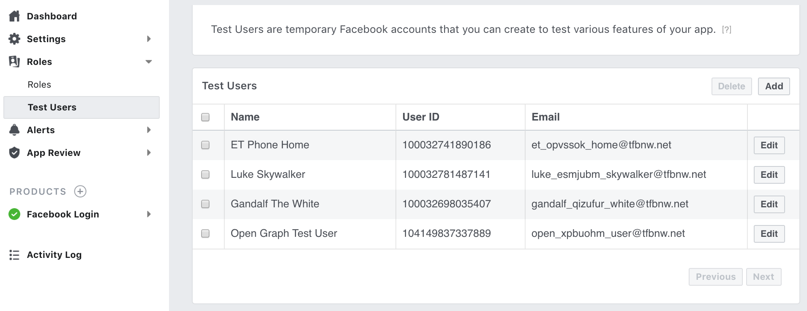

# Integrating OAuth and GraphQL to React

This document explains steps to make GraphQL query on ReactJS which needs
OAuth authentication (token based authentication).
When all steps in this document are completed, the entire repository will look like this
__[textblog repo]()__

This document assumes following three are already completed.
- OAuth by Facebook is setup and works (see [Setting Up Facebook Login](./SettingUpFacebookLogin.md))
- React client can get OAuth access token from Facebook and print to JavaScript console
(see [Using OAuth On GraphQL](./UsingOAuthOnGraphQL.md))
- On Insomnia (GraphQL IDE), user's information can be pulled using access token
(see [Using OAuth On GraphQL](./UsingOAuthOnGraphQL.md), also)

By now, very basic feature by ReactJS, GraphQL and OAuth is conformed to work
by going over previous documents. Here, more realistic UI and flow will be
implemented.

1. Top page design and story

    Before changing code, make sure what features need to add.
    Still, to keep it simple, the top page design is a simple one as in the
    picture below.

    

    - The page has SignIn link
    - If a user has been signed in, user's name appear here
    - If a user has been signed in, SignOut link shows up instead of SignIn
    - The page has multiple posts
    - To look at the posts, people don't need to sign in
    - Each post has a title, content, user and created/updated time

    Later, write/edit/delete post feature will be added.
    For now, token based authentication is used to show only in top bar, signed in or not.

2. Create multiple test users

    To make this app more realistic, let's add Facebook authenticate-able users.
    In this app, all users should be created by a given access token.
    So, add more users at Facebook developer website.
    
    
    
    At this moment, the sign in feature is not connected from ReactJS to Rails server.
    Create a user by making GraphQL mutation on Insomnia described in
    [Using OAuth on GraphQL](./UsingOAuthOnGraphQL.md).

3. Create a Post model and seed data

    For now, all posts will be created by seeding. Later, write/edit/delete feature will be
    added since those should be done by a signed in user.
    
    - Create a Post model
    
        The Post model has a title, content (created/updated time are automatically
        created by Rails). Additionally, associations -- a post belongs to a user,
        and a user has many posts -- should be created.
        
        `rails g model Post title:string content:text user:references`
        
        `rails db:migrate`
        
        Each post's title and content should not be empty, so adds validation.
        Open `app/models/post.rb` and add a line `validates_presence_of :title, :content`.
        ```ruby
        class Post < ApplicationRecord
          validates_presence_of :title, :content
          belongs_to :user
        end
        ```
        
    - Add has_many association to User
    
        Open `app/models/user.rb` and add a line `has_many :posts`.
        ```ruby
        class User < ApplicationRecord
          # Include devise modules.
          devise :omniauthable, omniauth_providers: [:facebook]
          # validation
          validates_presence_of :name, :email
          # Association
          has_many :posts
        
          def self.from_omniauth(auth)
            where(provider: auth.provider, uid: auth.uid).first_or_create do |user|
              user.email = auth.info.email
              user.name = auth.info.name
            end
          end
        end
        ```

    - Create seed data
    
        Users were already created manually calling `singInUser` GraphQL mutation
        using OAuth access token for user information. The seed will create posts
        tied to those users.
        
        Edit `db/seeds.rb` to replace all by following:
        ```ruby
        user_ids = User.ids
        posts = [
            {title: "What's up?",content: "What's going on here? Anything fun?"},
            {title: "Hello World", content: 'This is the first post made by me, so I\'m shouting "Hello World!"'},
            {title: "Hey Universe", content: "Yay! This is my post for the first time. What else are here?"}
        ]
        posts.each_with_index do |post, idx|
          User.find(user_ids[idx]).posts.create(post)
        end
        ```
        
        `rails db:seed`

4. Define and Update GraphQL schema

    - Define Post schema
    
        The Post model is newly added on the Rails side, so let's define PostType
        GraphQL schema first. Create a file `app/graphql/types/post_type.rb`. This
        looks like following:
        ```ruby
        Types::PostType = GraphQL::ObjectType.define do
          name "Post"
        
          field :id, !types.ID
          field :title, !types.String
          field :content, !types.String
          field :updated_at, !types.String
          field :user, !Types::UserType
        end
        ```
        
        Field names above are corresponding to the methods names Post instance has.

    - Update User schema
    
        Now, a user can have multiple posts. Open `app/graphql/types/user_type.rb`
        and add a line `field :posts, types[Types::PostType]`.
        ```ruby
        Types::UserType = GraphQL::ObjectType.define do
          name "User"
        
          field :id, !types.ID
          field :provider, !types.String
          field :uid, !types.ID
          field :name, !types.String
          field :email, !types.String
          field :posts, types[Types::PostType]
        end
        ```

    - Add `allPosts` query type
    
        The last schema to be updated is query type. Open `app/graphql/types/query_type.rb`
        and add `allPosts` field. 
        ```ruby
        Types::QueryType = GraphQL::ObjectType.define do
          name "Query"    
          ....
          ....    
          field :allPosts do
            type types[Types::PostType]
            description "returns a list of all posts"
            resolve -> (obj, args, ctx) {
              Post.all
            }
          end
        end
        ```

5. Make query on GraphiQL

    Test GraphQL query on either of GraphiQL or Insomnia. Notice, on Insomnia,
    schema is updated only when "Refresh Schema" is clicked.
    As in the mock image of top page, title, content and updated_at from PostType and
    name from UserType are all needed here.
    
    The query is:
    ```
    query {
      allPosts {
        title
        content
        updated_at
        user {
          name
        }
      }
    }
    ```
    Above query returns allPost along with user name.
    
    
    - Anecdote
    
        A GraphQL allows an infinitely nested query. For example,
        ```
        query {
          allPosts {
            title
            content
            updated_at
            user {
              name
              posts {
                title
                user {
                  name
                }
              }
            }
          }
        }
        ```
        works without any issue. The result will be:
        

6. Create React Components

    So far, Rails model and GraphQL schema are ready to show a list of posts.
    From this section, the work moves to React side.
    
    
    
For now, textblog app was confirmed to manage User sign up. Also, the app can show
a list of posts. Next topic is about [Testing GraphQL](./TestingGraphQL.md)
