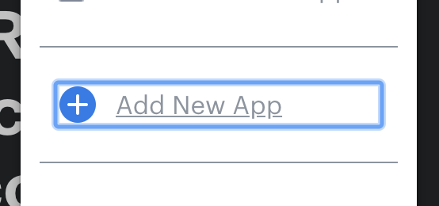
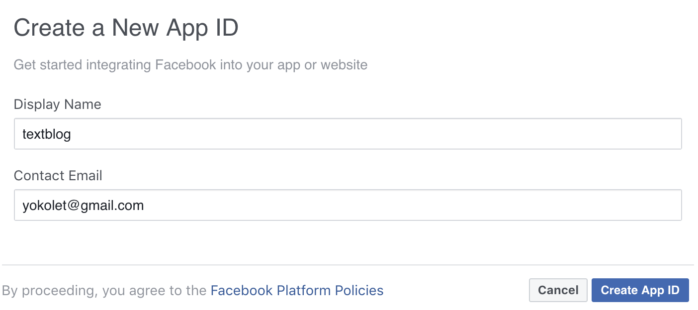
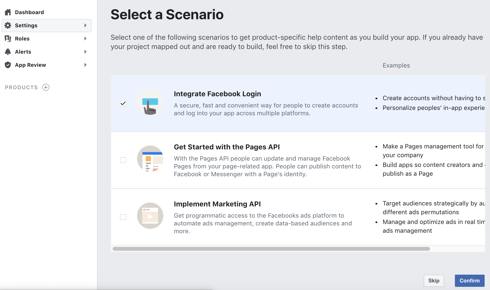
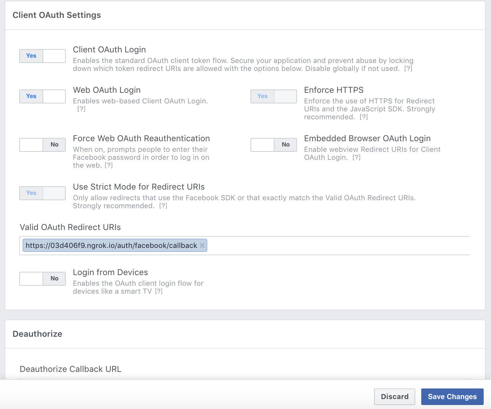

# Setting Up Facebook Login

### Facebook as an OAuth provider

Among many OAuth providers, this app chooses Facebook.
One of the reasons is Omniauth support. Additionally, this app uses GraphQL and React,
both of which are Facebook technologies. It's easy to guess using Facebook OAuth with
those would be easier.

Facebook's OAuth is called __Facebook Login__. This document explains steps to how to
setup Facebook Login.

Check the latest documents at [Facebook Login](https://developers.facebook.com/docs/facebook-login)
since Facebook often changes the way to setup and policies.

1. Web Site

    Go to the Developers website, [facebook for developers](https://developers.facebook.com/).

2. Prerequisite

    To setup Facebook login, people should be a Facebook developer. If not yet,
    register.
    
    Log in Facebook if not yet.

3. Create an App

    1. Click "__My App__ v", then "+ __Add New App__".
       
        
       
        
       
    2. Input Display Name and Contact Email, and click "Create App ID" button.

        
       
    3. Go over a security check.
    
        

4. Setup the App

    For now, the App has been created and people are navigated to the "Select a Scenario"
    page.
    
    1. Choose "Integrate Facebook Login" and click "Confirm" button.

        

    2. Click "Show" button at App Secret. Take memo of both App ID and Secret.

        

    3. Go to the bottom of the page and click "+ Add Platform" button.

        

    4. Select Website.
    
        

    4. Input Site URL, "http://localhost:3000/", and click "Save Changes" button.

        

    5. Click Facebook Login on the left pane, then click "Settings" tab.

    6. Input "https://localhost:3000/users/auth/facebook/callbak" in the
        Valid OAuth redirect URIs, then click "Save Changes".

        