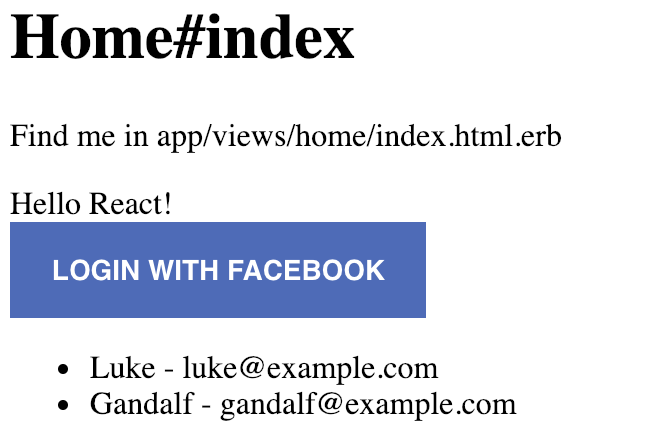
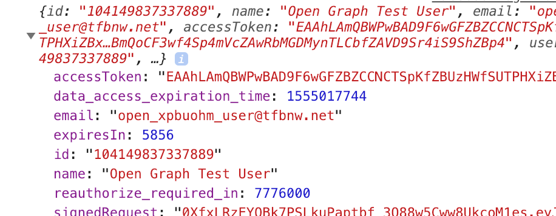
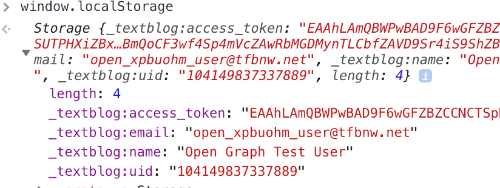
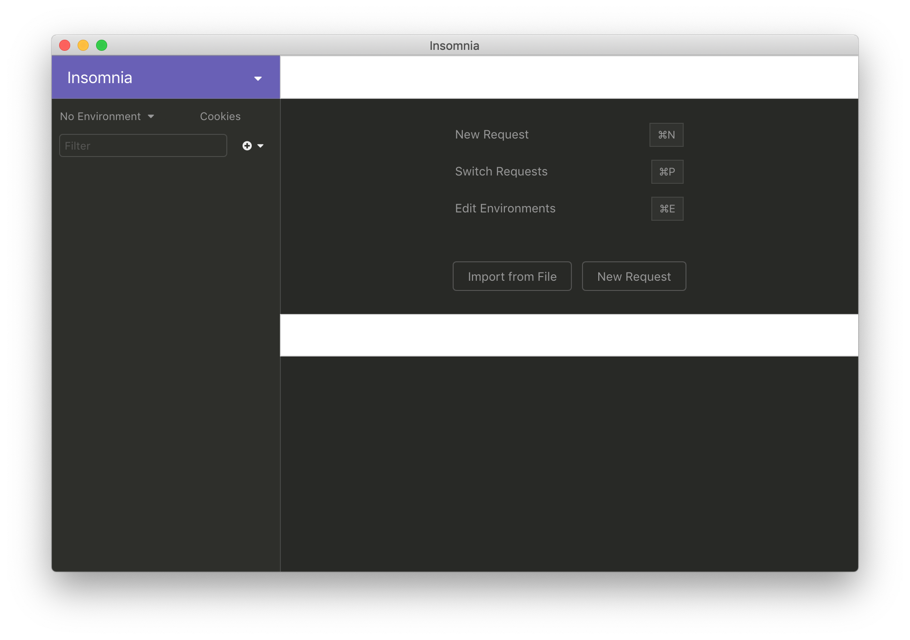
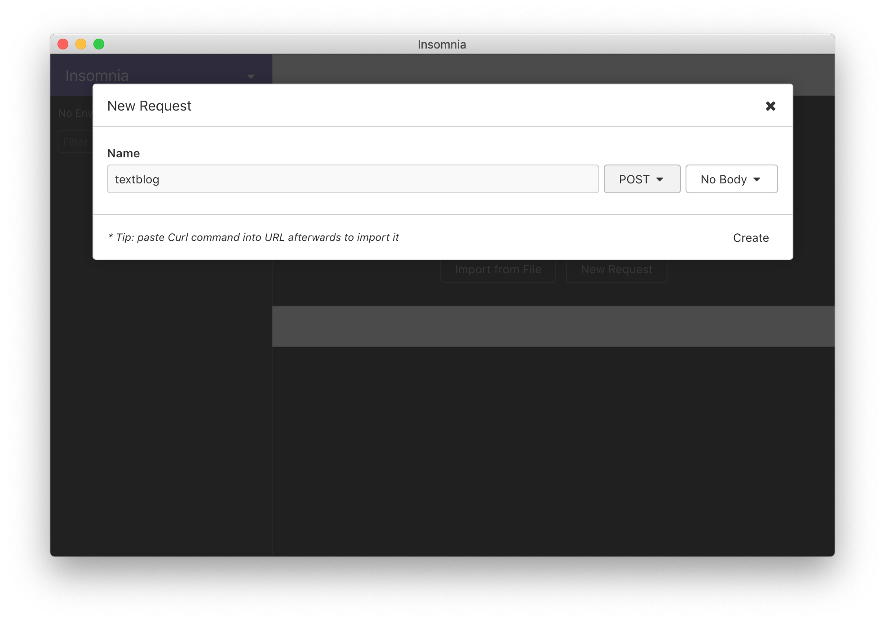
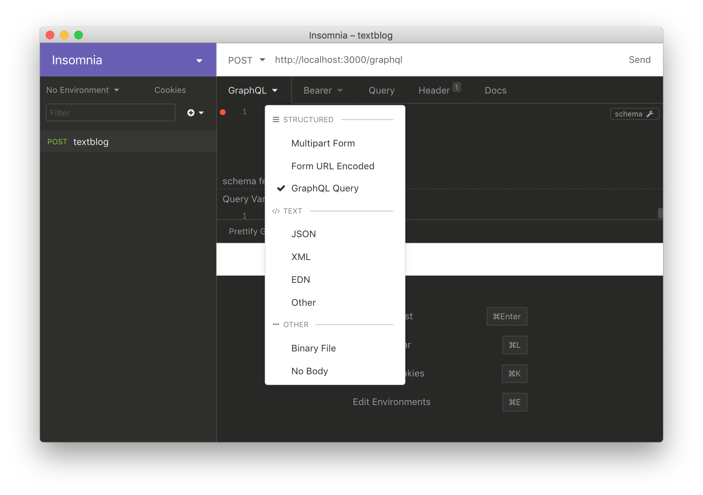
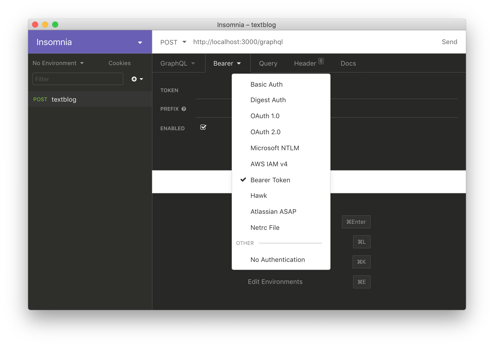
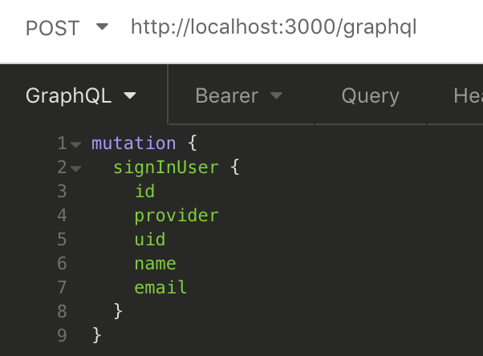
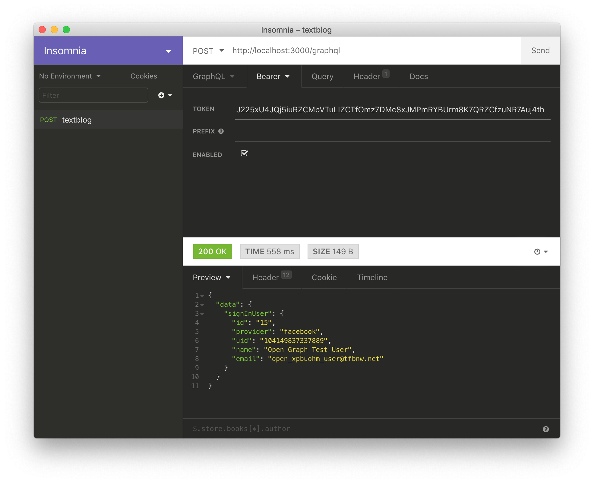

# Using OAuth on GraphQL - Client Side Flow

This document explains steps to authenticate users by OAuth using Facebook as OAuth provider.
When all steps in this document are completed, the entire repository will look like this
__[textblog repo](https://github.com/yokolet/textblog/tree/da7c055a6d887a07280b08fffeff5159c4b6c63b)__.

Before trying steps of this document, OAuth provider setting should be completed and tested.
Read [Setting Up Facebook Login](./SettingUpFacebookLogin.md) to learn how to setup
OAuth by Facebook.

This document focuses on ReactJS side and GraphQL. Only for this section,
[Insomnia](https://insomnia.rest/) will be used to test a sign in sequence by GraphQL mutations.
So far, the docs have used `GraphiQL`, which is an awesome IDE with nice code completion
and schema documentation. However, unfortunately, it doesn't provide a feature to set HTTP header.

The OAuth flow in this document is called a client side flow. The ReactJS (client) will
initiate the OAuth flow and get `access_token` first. Then, a token based authentication
starts. The `access_token` will be added to the HTTP request header,
`Authorization: Bearer ACCESS_TOKEN`. The GraphQL controller on the Rails side gets the
`access_token` and asks facebook to check who is making the request.

1. Install react-facebook-login package

    Not like Rails side, the ReactJS side doesn't have a standard way to add OAuth
    feature. The 'react-facebook-login' package is an easy and relatively well used tool,
    so it was chosen here.

    - Add `react-facebook-login` package
        ```bash
        yarn add react-facebook-login
        ```

2. `FacebookLoginButton` component

    - Create a file `app/javascript/packs/components/FacebookLoginButton.jsx`
    
        The value of YOURAPPID is the APP ID we can see on facebook developer website.
        Read [Setting Up Facebook Login](./SettingUpFacebookLogin.md) for details.
        ```javascript
        import React, { Component } from 'react'
        import FacebookLogin from 'react-facebook-login'
        
        class FacebookLoginButton extends Component {
            responseFacebook = (response) => {
                console.log(response)
                window.localStorage.setItem('_textblog:access_token', response.accessToken)
                window.localStorage.setItem('_textblog:uid', response.id)
                window.localStorage.setItem('_textblog:name', response.name)
                window.localStorage.setItem('_textblog:email', response.email)
            }
        
            componentClicked = (e) => {
                console.log(e)
            }
        
            render() {
                return (
                    <FacebookLogin
                        appId="YOURAPPID"
                        autoLoad={true}
                        fields="id,name,email"
                        onClick={this.componentClicked}
                        callback={this.responseFacebook}
                    />
                )
            }
        }
        
        export default FacebookLoginButton
        ```
        Above implementation is buggy, not nice one but works. For now, let's leave
        this naive code and focus on OAuth stuff.

3. Add `FacebookLoginButton` in the React app

    - Edit `app/javascript/packs/hello_react.jsx`
        ```javascript
        ....
        import FacebookLoginButton from './components/FacebookLoginButton'
        ....
        <ApolloProvider client={client}>
          <div>Hello {props.name}!</div>
          <FacebookLoginButton/>
          <UserList/>
        </ApolloProvider>
        ....
        ```

4. Test "Login With Facebook" Button

    - Make a HTTP request to `http://localhost:3000/`
        "Login With Facebook" Button shows up.
        
    - Open JavaScript console and click the button
        The `responseFacebook` function prints the response in the JavaScript console.
        Open the JavaScript console and click the button. The response looks like:
        
    - Check localStorage
        Some of the response parameters are saved in localStorage.
        Type `window.localStorage` in the JavaScript console to see those.
        
    - Take memo the value of access_token
        The access_token will be used to test GrapQL mutations. Save the value.

5. Get the access token in GraphQL

    This and following sections don't use the client side React app.
    Tests will be done on GraphQL IDE.
    GraphQL IDE is now switched to [__Insominia__](https://insomnia.rest/) to set
    Authorization HTTP request header. Interaction will be done
    between `GraphQLController` and __Insomina__.

    - Install `Koala` gem

        After the access token is pulled out from HTTP request header,
        the server app wants to verify who is making a request. To check this,
        the server should ask OAuth provider passing the access token.

        The `Koala` gem is library to hit Facebook Graph API endpoint for this
        kind of jobs.

        Add gem in `Gemfile`
        ```ruby
        gem 'koala', '~> 2.4'
        ```
        `bundle install`

    - Create a helper class

        To avoid controller code messy, also, to make it testable,
        the code to get the access token related will go to the helper.
        ```bash
        rails g helper Graphql
        ```
        Edit `app/helpers/graphql_helper.rb`
        ```ruby
        module GraphqlHelper
          def get_api(request)
            auth_header = request.headers["authorization"]
            if auth_header
              values = auth_header.split(' ')
              access_token = values.length == 2 && values.first == 'Bearer' ? values.last : nil
              koala = access_token ? Koala::Facebook::API.new(access_token) : nil
              return {access_token: access_token, koala: koala}
            else
              return {access_token: nil, koala: nil}
            end
          end
        end
        ```

    - Add `get_api` method call in `GraphqlController`
    
        Edit `app/controllers/graphql_controller.rb` and add two lines:
        `include GraphqlHelper` and `context[:api] = get_api(request)`
        ```ruby
        class GraphqlController < ApplicationController
          include GraphqlHelper
        
          skip_before_action :verify_authenticity_token
        
          def execute
            variables = ensure_hash(params[:variables])
            query = params[:query]
            operation_name = params[:operationName]
            context = {
              # Query context goes here, for example:
              # current_user: current_user,
            }
            context[:api] = get_api(request)
            result = TextblogSchema.execute(query, variables: variables, context: context, operation_name: operation_name)
            render json: result
            ....
          ....
        ```

6. Update GraphQL schemas

    - Add `signInUser` mutation

        A new mutation to sign-in user will be added here.
        Since queries don't need user authentication, the access token verification is
        performed in mutation's resolve method.
        
        Firstly, correctness of authorization header is checked.
        Then, the resolver asks Facebook for a user information.
        If an error is raised, the error message will be returned as a GraphQL object.
        The error is returned for various reasons. For example, a user was logged out
        from Facebook, a session was expired, or wrong access token was given (mostly
        copy&paste error during testing).
        
        Edit `app/graphql/types/mutation_type.rb` and add `:signInUser` field.
        ```ruby
        Types::MutationType = GraphQL::ObjectType.define do
          name "Mutation"
        
          field :signInUser, Types::UserType do
            resolve -> (obj, args, ctx) {
              access_token, koala = ctx[:api][:access_token], ctx[:api][:koala]
              if access_token.nil?
                raise GraphQL::ExecutionError.new('Authorization request header is missing.')
              end
              if koala.nil?
                raise GraphQL::ExecutionError.new('Authorization request header is invalid.')
              end
              begin
                me = koala.get_object('me', {'fields': 'id,name,email'}) # this line may raise error
                User.where(provider: 'facebook', uid: me['id']).first_or_create do |user|
                  user.name = me['name']
                  user.email = me['email']
                end
              rescue => e
                GraphQL::ExecutionError.new(e.message)
              end
            }
          end
        ....
        ....
        ```
    - Update `user_type` schema

        While going over [Adding OAuth](./AddingOAuth.md), `provider` and `uid` columns
        were added to User model. To make it consistent, add those in GraphQL schema.
        
        Edit `app/graphql/types/user_type.rb` and add `provider` and `uid` fields.
        ```ruby
        Types::UserType = GraphQL::ObjectType.define do
          name "User"
        
          field :id, !types.ID
          field :provider, !types.String
          field :uid, !types.ID
          field :name, !types.String
          field :email, !types.String
        end
        ```

7. Test GraphQL mutation on __Insominia__

    - Run Insominia

        For the first time, Insominia show the window like this:

        
    - Create a new request
    
        On OSX, hit command-n key or click + (plus) button on the left pane, then
        create a new request.
        
        
        
        HTTP method to make GraphQL is always POST. This can be checked by typing
        `rails routes`.
        ```bash
        graphql POST     /graphql(.:format)
        ```
    - Write URL and select GraphQL
    
        Write POST URL, `http://localhost:3000/graphql`. Also, select `GraphQL` from Body
        dropdown.
        
        
    - Select Bearer from Auth dropdown
    
        
    - Write a mutation
        ```
        mutation {
          signInUser {
            id
            provider
            uid
            name
            email
          }
        }
        ```
        
    - Set valid/invalid access token in Bearer or leave it blank

        In the section 4 of this document, the access token was shown in JavaScript console.
        This is the one to test. If the valid access token is set in Bearer and click "Send",
        a user information will be returned.
        
        
        
        Additionally, if the user is not on the database, the user will be created.
        This can be checked by requesting http://localhost:3000/ or Rails console.
        
        If Bearer is blank or has invalid token, the result is an error message.


For now, textblog app got an user authentication feature by GraphQL.
Next topic is about [Creating Top Pagr](./CreatingTopPage.md).
