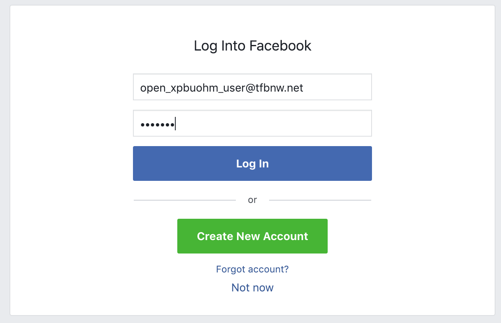
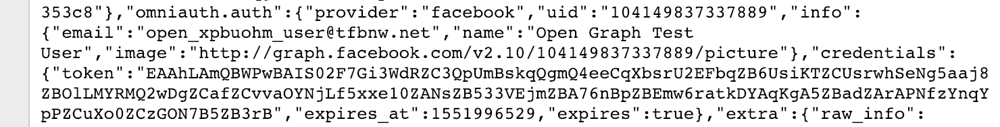

# Setting Up Facebook Login

This document explains steps to setup Facebook OAuth and how to test it.
When all steps in this document are completed, the entire repository will look like this
__[textblog repo](https://github.com/yokolet/textblog/tree/5d0cbe8b29545439f1b208504cf6637a963a18f3)__
(the repository at this point in the history).

### Facebook as an OAuth provider

Among many OAuth providers, this app chooses Facebook as the first OAuth provider.
There's no specific reason of a choice here. Only small one would be 
this app uses GraphQL and React. Both of those are Facebook technologies.
It may be easy to integrate Facebook OAuth with them. 


Although how to set up on the provider side varies, Ruby/JavaScript sides are
expected to stay the same as other OAuth providers. Actually, Ruby code is almost identical
even though the providers are different. It's easy to support multiple OAuth providers
once an authentication is confirmed to work.


Facebook's OAuth is called __Facebook Login__. This document explains steps to how to
setup Facebook Login.

Check the latest documents at [Facebook Login](https://developers.facebook.com/docs/facebook-login)
since Facebook often changes the way to setup and policies.


1. Web Site

    Go to the Developers website, [facebook for developers](https://developers.facebook.com/).

2. Prerequisite

    To setup Facebook login, people should be a Facebook developer. If not yet,
    register.
    
    Additionally, log in Facebook if not yet.

3. Create an App

    1. Click __My App__.
       
        

    2. Choose __Add New App__ from a dropdown menu.
       
        
       
    2. Input Display Name and Contact Email, and click __Create App ID__ button.

        
       
    3. Go over a security check.
    
        

4. Setup the App

    For now, the App has been created, and the screen is navigated to the "Select a Scenario"
    page.
    
    1. Choose __Integrate Facebook Login__ and click __Confirm__ button.

        

    2. Click __Show__ button in the "App Secret" section. Take memo of both App ID and Secret.

        
 
5. Install and Run __ngrok__ (for testing)

    OAuth needs callback URL which should be reachable from the OAuth provider.
    If the app is live at somewhere on the Internet, say AWS, there's no need
    to use ngrok. However, this app is still under development/test on a localhost,
    ngrok is used here.
    
    [__ngrok__](https://ngrok.com) is easy to install, setup, and also easy to run
    forwarding application. It forwards HTTPS as well, which is feasible to test
    Facebook login. Facebook requires HTTPS for the callback url, so ngrok is useful.
    
    1. Download and Install
    
        Go to [ngrok.com](https://ngrok.com) and login or signup. Then following
        the instruction, download the archive and extract (just extract, no need to
        'install').
        
    2. Setup and Run ngrok
    
        Go to the directory where `ngrok` executable exists.
        After login to the ngrok account, the authtoken can be found easily.
        Since Rails uses 3000 by default, 3000 is set to run ngrok.
        
        ```bash
        ./ngrok authtoken YOURAUTHTOKEN
        ./ngrok http 3000
        ```
        
        When ngrok starts running, it shows the info something like:
        
        ```bash
        ngrok by @inconshreveable                                                          (Ctrl+C to quit)
        
        Session Status                online
        Account                       Yoko Harada (Plan: Free)
        Version                       2.2.8
        Region                        United States (us)
        Web Interface                 http://127.0.0.1:4040
        Forwarding                    http://03d406f9.ngrok.io -> localhost:3000
        Forwarding                    https://03d406f9.ngrok.io -> localhost:3000
        
        Connections                   ttl     opn     rt1     rt5     p50     p90
                                      0       0       0.00    0.00    0.00    0.00
        ```
        
        Take a memo of HTTPS fowarding URL.

6. Setup Facebook Login

    Get back to Facebook App setting website.

    1. Click Facebook Login on the left pane, then click "Settings" tab.

    2. Set __Valid OAuth redirect URIs__

        Now, a public HTTPS URL is proved by ngrok, so a callback path is
        the next to choose. Normally, Rails + devise/omniauth combination uses
        `/users/auth/facebook/callback`. However, before going further, let's
        test OAuth by a simple way.

        The `omniauth-facebook` gem has an example by Sinatra,
        [https://github.com/mkdynamic/omniauth-facebook/tree/master/example](https://github.com/mkdynamic/omniauth-facebook/tree/master/example).
        This is a good example to test. In this case, the callback is `/auth/facebook/callback`.

        Input "https://03d406f9.ngrok.io/auth/facebook/callback" in the
        Valid OAuth redirect URIs, then click "Save Changes".

        

7. Create a test user

    Facebook allows a developer to create users just for testing. The test user has
    limitations, but it's nice to check the app works.
    
    1. Click "Roles", then "Test Users" tab.
    
    2. Add a new user or set a password of existing user
    
        By default, one test user is there. To log in to Facebook as the default test user,
        the password should be set. Click __Edit__ button and choose "Change the name or
        password for this test user".
    
        

    3. Input the password and click __Save__ button

        

    4. (Optional) Log in to Facebook as a test user
    
        Log in to Facebook using the test user's email and password.
        It's good to use Incognito or different web browser. Since one browser
        is for setting things up for the app with the real account.
        Logging out, deleting cookies, etc. confuse testing.

8. Create a test Sinatra app

    This is just a test, so the test Sinatra app can be created in any directory.
    To put together in the same repo, all are in `example` directory.
    
    - Gemfile

        ```ruby
        # frozen_string_literal: true
        
        source "https://rubygems.org"
        
        git_source(:github) {|repo_name| "https://github.com/#{repo_name}" }
        
        gem 'sinatra'
        gem 'sinatra-reloader'
        gem 'omniauth-facebook'
        gem 'dotenv'
        ```
        
        Run `bundle install`.

    - Create `app.rb`
        ```ruby
        require 'sinatra'
        require 'sinatra/reloader'
        require 'yaml'
        
        set :run, false
        set :raise_errors, true
        set :protection, except: [:json_csrf]
        
        get '/server-side' do
          redirect '/auth/facebook'
        end
        
        get '/auth/:provider/callback' do
          content_type 'application/json'
          MultiJson.encode(request.env)
        end
        ```

    - Create `config.ru`
        ```ruby
        require 'bundler/setup'
        require 'dotenv/load'
        require 'omniauth-facebook'
        require './app.rb'
        
        use Rack::Session::Cookie, secret: 'abc123'
        
        use OmniAuth::Builder do
          provider :facebook, ENV['FB_APP_ID'], ENV['FB_APP_SECRET']
        end
        
        run Sinatra::Application
        ```

    - Create `.env` in the same directory as `config.ru`

        Write the App ID and App Secret previously made memo.
        ```ruby
        FB_APP_ID=YOURAPPID
        FB_APP_SECRET=YOURAPPSECRET
        ```

9. Test OAuth

    1. Run Sinatra app
    
        Since __ngrok__ was set up to forward port 3000, run Sinatra on port 3000.
        ```bash
        rackup -p 3000
        ```
    2. Validate redirect URI
    
        For now Sinatra is up and running, so callback URI is active.
        It's time to validate the redirect URI on Facebook.
        
        1. Go to Facebook App setting website.
        2. Click Facebook Login, Settings tab on the left pane.
        3. Input callback URI and click __Check URI__ button.
            

    3. Open Incognito or another browser
    
    4. Request `http://localhost:3000/servier-side`
    
    5. Log in to Facebook as a test user (if not yet logged in)
    
        

    5. Approve the OAuth, "Continue as ACCOUNT"

        

    6. Check the returned status
    
        The browser should show a bunch of parameters. On the bottom area, "omniauth.auth"
        key is there. This is the info for Rails to do some stuff.
        
        

10. Check App on Facebook

    On the test user's facebook account, the app can be checked whether it is used.
    
    1. Go to the test user's facebook account and click triangle button on the right end.
    
        

    2. Click "Settings", then "Apps and Websites" on the left pane.
    
        

    3. Re-test
    
        The page should have the icon with the app name. To test again,
        remove the app and request `http://localhost:3000/server-side` again.
        Reload the apps and websites page, then the app will appear again. 