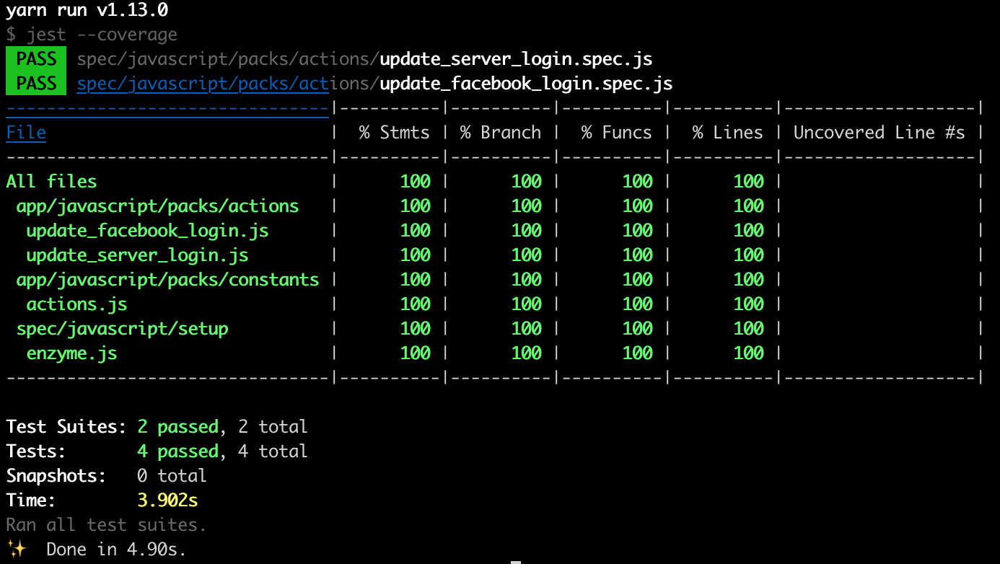

# Testing React and Redux

This document explains steps to test React and Redux.
When all steps in this document are completed, the entire repository will look like
the repository at this point in the history [
[__github__](https://github.com/yokolet/textblog/tree/)
|
[__gitlab__](https://gitlab.com/yokolet/textblog/tree/)
].

As stated in the previous document, [Testing GraphQL](./TestingGraphQL.md),
this textblog app needs three types of testing: React/Redux, GraphQL and Rails
testing. The first pick was GraphQL testing, and the second pick, here, is
React/Redux testing.

1. Install React/Redux testing packages

    To test React/Redux, a client side testing framework should be
    installed. At this moment, the combination of `Jest` and `Enzyme`
    is the most popular testing tools for React/Redux.

    - Install `jest`, `babel-jest` and `babel-preset-es2015`

        `Jest` is a JavaScript testing framework whose syntax is similar to Rspec.
        When `Jest` package is installed, `Babel`'s Jest support should be
        installed as well. 
        Since this textblog app uses the webpacker, `Babel` is working
        behind the scene to compile React to JavaScript.

        ```bash
        yarn add --dev jest babel-jest babel-preset-env 
        ``` 

    - Install `enzyme`, `enzyme-adapter-react-16` and `enzyme-to-json`

        `Enzyme` is a React component testing framework.
        `Enzyme` has an adapter system to support different versions of React.
        When installing `enzyme` package, its adapter should be added also.
        The last package, `enzyme-to-json`, is used to convert React component
        output to JSON. If it is in a JSON format, React component testing
        becomes much easier. 

        ```bash
        yarn add --dev enzyme enzyme-adapter-react-16 enzyme-to-json
        ```

    - Install `redux-mock-store`

        The `redux-mock-store` provides a mock Redux store to test Redux actions.

        ```bash
        yarn add --dev redux-mock-store
        ```

2. Setup testing environment

    `Jest` has its own various settings. If it is a typical React project,
    default settings would have worked well. However, here, `Jest` should run under
    Rails directory structure. To make `Jest` fit in Rails env, it needs a couple
    of settings.

    - Create a directory

        The rule is, a directory structure under spec is the same as one under app.
        ReactJS code resides under `app/javascript/packs`, so create
        `spec/javascript/packs` directory.

        ```bash
        mkdir -p spec/javascript/packs
        ``` 
    - Tell `Jest` where and how

        `Jest` needs to know where test files are located. Since `Jest` does
        exhaustive search for test files, `spec/javascript` would be good dir.

        Following `moduleDirectory` setting is similar one to Rails' requiring files
        for testing. For example, `rails_helper.rb` has the line, 
        `Dir[Rails.root.join('spec', 'support', '**', '*.rb')].each { |f| require f }`
        (commented out by default). JavaScript equivalent is the `moduleDirectories` setting.

        Additionally, really like Rails, `Jest` can run by the commend `yarn spec`.
        Below has the setting of this.

        Open `package.json` and add below:

        ```javascript
        {
          ....
          ....
          "jest": {
            "roots": [
              "spec/javascript"
            ],
            "moduleDirectories": [
              "node_modules",
              "app/javascript/packs"
            ]
          },
          "scripts": {
            "spec": "jest"
          }
        }
        ```

    - Update `.babelrc`

        A small update in `.babelrc` should be done so that babel understands
        syntax of a current ES version. Add `"env"` in the top level array.
        The file will have two "env"s.

        ```javascript
        {
          "presets": [
            "env",
            [
              "env",
              {
        ```

    - Configure `Enzyme`

        As mentioned already, `Enzyme` uses the adapter system to support different
        versions of ReactJS. Because of this, `Enzyme` needs an adapter configuration.

        Create a directory and file. This can be any directory or filename.
        Here, the directory and filename will be `spec/javascript/setup/enzyme.js`.

        ```bash
        mkdir -p spec/javascript/setup
        touch spec/javascript/setup/enzyme.js
        ```

        ```javascript
        import Enzyme from 'enzyme'
        import Adapter from 'enzyme-adapter-react-16'

        Enzyme.configure({ adapter: new Adapter() })
        ```

        In the `"jest"` block of `package.json`, add `setupTestFrameworkScriptFile` key
        and the Enzyme config filename as a value.
        Additionally, `"testPathIgnorePatterns": ["spec/javascript/setup"]` should be
        added.

        ```javascript
        "jest": {
            "roots": [
              "spec/javascript"
            ],
            "moduleDirectories": [
              "node_modules",
              "app/javascript/packs"
            ],
            "setupTestFrameworkScriptFile": "./spec/javascript/setup/enzyme.js",
            "testPathIgnorePatterns": ["./spec/javascript/setup"]
          },
        ```

3. Refactoring

    Before going forward to Redux testing, let's do some refactoring.
    At this moment, all actions are put together in a single file.
    It may be ok for now since only two actions are there. However, the number of
    action will increase as the app becomes more realistic.

    The reducer is the same. At this moment, it's ok to branch just two
    actions in a switch statement. But, as more actions will be added,
    the switch block grows bigger.

    That leads to messy code. The goal here is to separate actions/reducers to
    individual file.

    - Refactoring actions

        Create `app/javascript/packs/actions/update_facebook_login.js` and
        write `updateFacebookLogin` action.

        ```javascript
        import { UPDATE_SOCIAL_LOGIN } from '../constants/actions'
        
        export const updateFacebookLogin = (response) => {
          let user = {
            access_token: response.accessToken,
            uid: response.userID,
            name: response.name,
            email: response.email
          }
          return {
            type: UPDATE_SOCIAL_LOGIN,
            provider: 'facebook',
            user
          }
        }
        ```

        Create `app/javascript/packs/actions/update_server_login.js` and
        write `updateServerLogin` action.

        ```javascript
        import { UPDATE_SERVER_LOGIN } from '../constants/actions'
        
        export const updateServerLogin = (data) => {
          return {
            type: UPDATE_SERVER_LOGIN,
            user: data.signInUser
          }
        }
        ```

        Finally, delete `app/javascript/packs/actions/index.js`

    - Update action references in components

        Above action refactoring changed action filenames. React components
        need to update references to actions.

        Open `app/javascript/packs/components/FacebookLoginButton.jsx` and change
        import statement as in below:

        ```javascript
        import { updateFacebookLogin } from '../actions/update_facebook_login'
        ```

        Open `app/javascript/packs/components/User.jsx` and change import as in
        below:

        ```javascript
        import { updateServerLogin } from "../actions/update_server_login"
        ```

    - Refactoring reducers

        Create `app/javascript/packs/reducers/social_login.js` and
        write `socialLogin` reducer.

        ```javascript
        import { UPDATE_SOCIAL_LOGIN, } from '../constants/actions'
        
        const initialState = {
          provider: '',
          user: null,
        }
        
        const socialLogin = (state = initialState, action) => {
          switch (action.type) {
            case UPDATE_SOCIAL_LOGIN:
              return {
                ...state,
                provider: action.provider,
                user: action.user
              }
            default:
              return state
          }
        }
        
        export default socialLogin
        ```

        Create `app/javascript/packs/reducers/server_login.js` and
        write `serverLogin` reducer.

        ```javascript
        import { UPDATE_SERVER_LOGIN } from '../constants/actions'
        
        const initialState = {
          user: null,
          isAuthenticated: false
        }
        
        const serverLogin = (state = initialState, action) => {
          switch (action.type) {
            case UPDATE_SERVER_LOGIN:
              return {
                ...state,
                user: action.user,
                isAuthenticated: action.user && action.user.id ? true : false
              }
            default:
              return state
          }
        }
        
        export default serverLogin
        ```

        Update `app/javascript/packs/reducers/index.js` to combine reducers.

        ```javascript
        import { combineReducers } from 'redux'
        import socialLogin from './social_login'
        import serverLogin from './server_login'
        
        export default combineReducers({
          socialLogin,
          serverLogin
        })
        ```

    - Update reducer references in components

        Since two reducers' output states were combined, each state got
        a key. Above notation in `combineReducers` is a shortcut of
        JavaScript's map. It means actually:

        ```javascript
        {
          socialLogin: socialLogin,
          serverLogin: serverLogin
        }
        ```

        In the components, `state.provier` turns to `state.socialLogin.provider`,
        and `state.isAuthenticated` turns to `state.serverLogin.isAuthenticated`.
        Others are the same.
        
        Open `app/javascript/packs/components/FacebookLoginButton.jsx` and update
        the reference to:
        
        ```javascript
        access_token: state.socialLogin.user ? state.socialLogin.user.access_token : '',
        ```

        Open `app/javascript/packs/components/User.jsx` and update
        the reference to:

        ```javascript
        provider: state.socialLogin.provider,
        access_token: state.socialLogin.user ? state.socialLogin.user.access_token : '',
        user_id: state.serverLogin.user ? state.serverLogin.user.id : '',
        name: state.serverLogin.user ? state.serverLogin.user.name : '',
        isAuthenticated: state.serverLogin.isAuthenticated
        ```

        Open `app/javascript/packs/components/NavBar.jsx` and update
        the reference to:
        
        ```javascript
        isAuthenticated: state.serverLogin.isAuthenticated
        ```

4. Create Redux action specs

    The refactoring made action specs focused. Each spec file contains
    tests against a single action. (It may be multiple, but all should be
    the same kind.)

    Create a directory and file.

    ```bash
    mkdir -p spec/javascript/packs/actions
    touch spec/javascript/packs/actions/update_facebook_login.spec.js
    ```

    The action specs looks like this:

    ```javascript
    import configureStore from 'redux-mock-store'
    import * as actions from 'actions/update_facebook_login'
    import * as types from 'constants/actions'
    
    const mockStore = configureStore()
    const store = mockStore()
    
    describe('updateFacebookLogin', () => {
      beforeEach(() => {
        store.clearActions()
      })
    
      const response = {
        accessToken: 'a1b2c3d4e5f6g7h8i9j0',
        userID: 1234567890,
        name: 'my name',
        email: 'myemail@example.com'
      }
      
      const expectedAction = {
        type: types.UPDATE_SOCIAL_LOGIN,
        provider: 'facebook',
        user: {
          access_token: 'a1b2c3d4e5f6g7h8i9j0',
          uid: 1234567890,
          name: 'my name',
          email: 'myemail@example.com'
        }
      }
    
      it('should create an action to return user info', () => {
        expect(actions.updateFacebookLogin(response)).toEqual(expectedAction)
      })
    
      it('should dispatch action and return expected result', () => {
        store.dispatch(actions.updateFacebookLogin(response))
        expect(store.getActions()).toEqual([expectedAction])
      })
    })
    ```

    The spec has two types of tests: directory invokes action function and
    dispatches an action to see Redux mock store change.
    
    Create `spec/javascript/packs/actions/update_server_login.spec.js` file
    and add some specs which should be similar to above.

    The spec runs by the command:

    ```bash
    yarn spec
    ```

    If `--coverage` option is added, `Jest` will report the coverage.

    ```bash
    yarn spec --coverage
    ```

    

5. Create Redux reducer specs

    The same as action specs, the refactoring made reducer specs focused.
    In the same manner, write reducer specs. However, not like actions,
    the reducer specs can't use the redux-mock-store. This is the limitation of
    the package.

    Create a directory and file.

    ```bash
    mkdir -p spec/javascript/packs/reducers
    touch spec/javascript/packs/reducers/social_login.spec.js
    ```

    The reducer spec looks like this:

    ```javascript
    import reducer from 'reducers/social_login'
    import * as types from 'constants/actions'
    
    describe('social_login', () => {
      const initialState = {
        provider: '',
        user: null,
      }
    
      it('should return the initial state', () => {
        const action = { type: 'DUMMY' }
    
        expect(reducer(undefined, action)).toEqual(initialState)
      })
    
      it('should handle UPDATE_SOCIAL_LOGIN', () => {
        const action = {
          type: types.UPDATE_SOCIAL_LOGIN,
          provider: 'facebook',
          user: {
            access_token: 'a1b2c3d4e5f6g7h8i9j0',
            uid: 1234567890,
            name: 'my name',
            email: 'myemail@example.com'
          }
        }
    
        const expectedState = {
          provider: 'facebook',
          user: {
            access_token: 'a1b2c3d4e5f6g7h8i9j0',
            uid: 1234567890,
            name: 'my name',
            email: 'myemail@example.com'
          }
        }
    
        expect(reducer(initialState, action)).toEqual(expectedState)
      })
    })
    ```

    The social_login spec tests dummy and successful actions.
    For server_login reducer,
    create `spec/javascript/packs/actions/update_server_login.spec.js`
    and write specs.

    Again, spec runs by the command:

    ```bash
    yarn spec
    ```

6. Create React component specs

    When it comes to React testing, many kinds of testings are there.
    Just a component rendering test, combination of Redux store change and
    React component, GraphQL response driven component rendering, routing, etc.

    UI is the part of application that changes frequently while developing.
    Too many testings may cause frustration. What to test should be
    considered.
    This textblog app starts off by a small set of React component specs.
    Thinking of the app now, components need to be tested are
    `FacebookLoginButton` and `User`.

    - Create `FacebookLoginButton` component spec

        The `FacebookLoginButton` component initiates the client side OAuth flow.
        Then, it updates Redux store and redirects to a home page.
        This logic should be tested.

        ```bash
        mkdir -p spec/javascript/packs/components
        touch spec/javascript/packs/components/FacebookLoginButton.spec.js
        ```

        The spec `FacebookLoginButton.spec.js` looks like this:

        ```javascript
        import React from 'react'
        import { mount, shallow } from 'enzyme'
        import toJson from 'enzyme-to-json'
        import { Provider } from 'react-redux'
        import { BrowserRouter as Router, Redirect } from 'react-router-dom'
        import { createStore } from 'redux'
        import reducer from 'reducers'
        import * as actions from 'actions/update_facebook_login'
        import FacebookLoginButton from 'components/FacebookLoginButton'
        
        describe('<FacebookLoginButton />', () => {
          describe('render()', () => {
            let wrapper
            beforeEach(() => {
              wrapper = shallow(<FacebookLoginButton/>)
            })
            it('renders a component', () => {
              expect(toJson(wrapper)).toMatchSnapshot()
            })
          })
        
          describe('with Redux store', () => {
            const store = createStore(reducer)
            let response = {
              accessToken: 'a1b2c3d4e5f6g7h8i9j0',
              userID: 1234567890,
              name: 'my name',
              email: 'myemail@example.com'
            }
        
            it('sees store', () => {
              store.dispatch(actions.updateFacebookLogin(response))
              let wrapper = mount(
                <Provider store={store}>
                  <Router>
                    <FacebookLoginButton/>
                  </Router>
                </Provider>)
              expect(wrapper.find(Redirect)).toHaveLength(1)
            })
          })
        })
        ```

        Above spec has two kinds of tests. The first one tests
        component output by Jest's `toMatchSnapshot` function.
        Enzyme's `shallow` function renders a top level component,
        so it's good to test existence.

        The second one tests react-router's `Redirect` is rendered
        after Redux `updateFacebookLogin` action is dispatched.
        Enzyme's `mount` function renders full DOM including child
        components. Also, it updates Redux store as well.
        After Redux action is dispatched, `access_token` property
        will have a value. It means the page will be redirected to
        the home.

    - Create `User` component spec

        The `User` component has a scenario to be tested. The component is
        mounted when the top page is rendered. The component specifically
        looks at `socialLogin.access_token` and `serverLogin.isAuthenticated`
        state values in Redux store and behaves accordingly:
    
        | access_token | isAuthenticated | component behavior     |
        |:------------:|:---------------:|:----------------------:|
        | undefined    | false           | renders `<li></li>`    |
        | valid value  | false           | makes GraphQL mutation |
        | valid value  | true            | renders `<li>NAME</li>`|
    
        Above should be tested.
    
        ```bash
        touch spec/javascript/packs/components/User.spec.js
        ```

    
    
For now, the textblog app got specs for Redux actions/reducers and React componenta.
Next topic is about [Adding Error Handling](./AddingErrorHandling.md)
